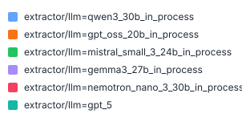
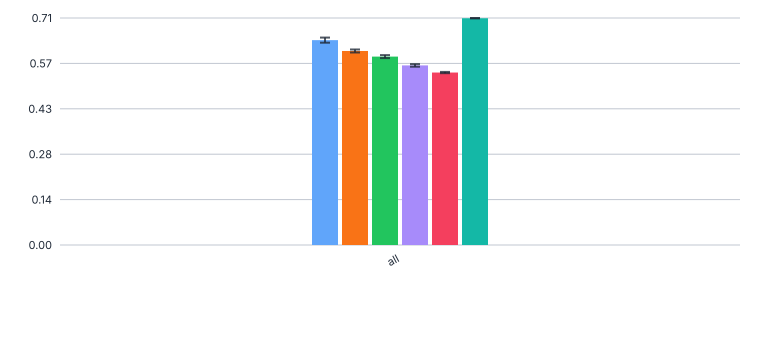
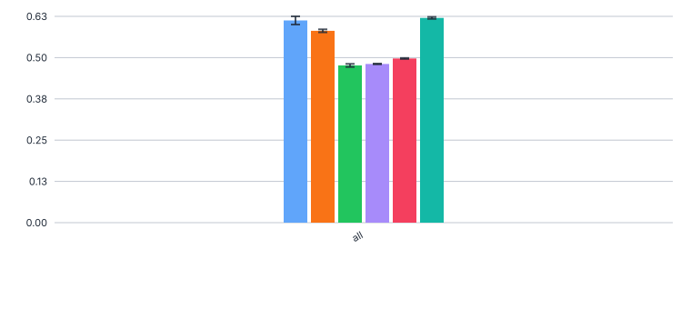
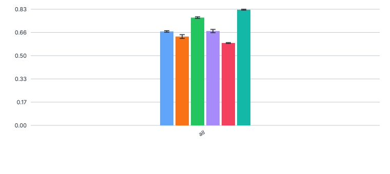
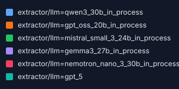
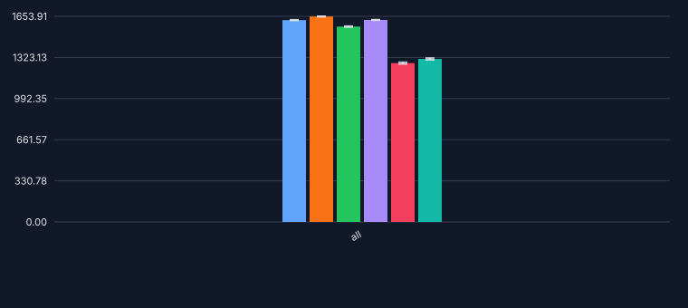
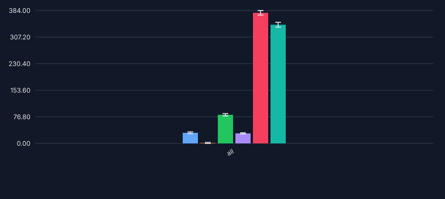
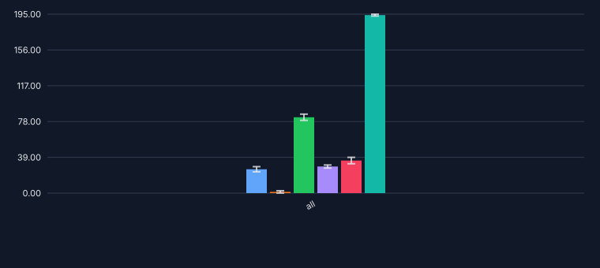
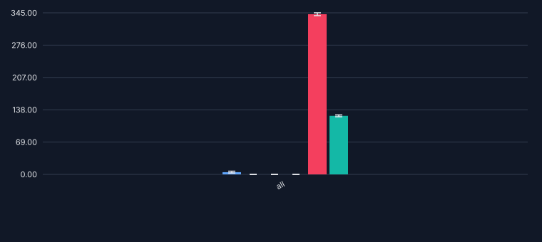
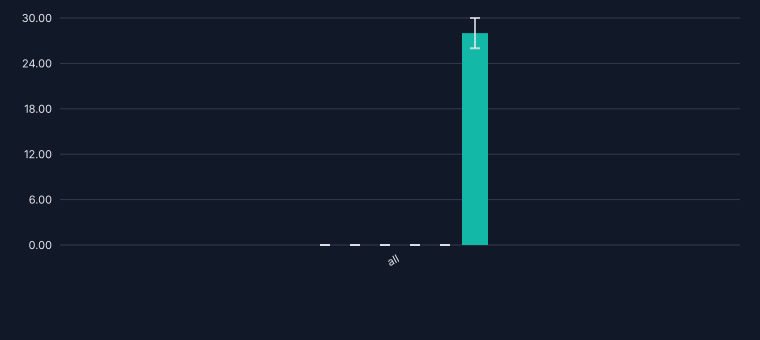

# 251_nemotron_faktencheck_core

Evaluates `nvidia/NVIDIA-Nemotron-3-Nano-30B-A3B-FP8` on the 100-PDF dev set using the current
default setup (`faktencheck_core_fields_schema_with_chunking`), as established in
[397_faktencheck_core_v1_for_chunking](../397_faktencheck_core_v1_for_chunking).

**Motivation**: Add Nemotron-Nano-30B (FP8-quantized MoE reasoning model from NVIDIA) to the
faktencheck core benchmark to compare its extraction quality against existing models (qwen3_30b,
gpt_oss_20b, etc.). Part of PR [#399](https://github.com/DFKI-NLP/kibad-llm/pull/399) /
issue [#251](https://github.com/DFKI-NLP/kibad-llm/issues/251).

## Prediction

```sh
./run_in_process.sh -t "2-00:00:00" -pa "H100-SLT,H100-Trails,H100,H200,B200" -ng 2 -sr \
  -r bbc92953c87d906cafe8d8288b714acad98b6723 \
  -u "-m kibad_llm.predict \
  name=251_nemotron_faktencheck_core \
  experiment/predict=faktencheck_core_fields_schema_with_chunking \
  pdf_directory=/ds/text/kiba-d/dev-set-100 \
  extractor/llm=nemotron_nano_3_30b_in_process \
  extractor.llm.vllm_kwargs.tensor_parallel_size=2 \
  pdf_reader_num_proc=200 \
  seed=42,1337,7331 \
  --multirun"
```

Result location: `logs/251_nemotron_faktencheck_core/predict/multiruns/2026-05-30_02-33-58`

Non-default parameters:
- `extractor.llm.vllm_kwargs.tensor_parallel_size=2`: overrides the config default (`1`) to shard
  the model across 2 GPUs (`-ng 2`), improving throughput for the 30 B-parameter model.
- `pdf_reader_num_proc=200`: overrides the default (`null`, sequential) to parallelise PDF-to-
  markdown conversion; the HuggingFace datasets library automatically caps this to the dataset size
  (100 processes for the 100-PDF dev set, as shown in the run logs).

Seeds 42 and 1337 completed successfully (~13h and ~12h respectively). Seed 7331 failed with an
`EngineDeadError` (vLLM engine core crash after ~5 min of the third seed — transient GPU fault after
~25h of continuous operation, not a config issue). A standalone rerun of seed 7331 hit a separate
`UnicodeEncodeError` (surrogate character `\udd7a` in a PDF that PyArrow cannot serialize), which
did not occur in the original multirun because PDF conversion results were cached from seed=42.
This is a preprocessing bug tracked separately. Evaluation below uses seeds 42 and 1337 only.

## Evaluation

Run from within `data/prediction_results/`:

```sh
uv run -m kibad_llm.evaluate \
name=251_nemotron_faktencheck_core \
experiment/evaluate=faktencheck_core_f1_micro_flat \
hydra.callbacks.save_job_return.multirun_show_file_contents=null \
dataset.references.file=../interim/faktencheck-db/faktenscheck_core_corrected.jsonl \
"metric.fields=[habitat,biodiversity_level,ecosystem_type.term,ecosystem_type.category,taxa.species_group]" \
"prediction_logs=[logs/251_nemotron_faktencheck_core/predict/multiruns/2026-05-30_02-33-58/0,logs/251_nemotron_faktencheck_core/predict/multiruns/2026-05-30_02-33-58/1]" \
--multirun
```

Result location: `logs/251_nemotron_faktencheck_core/evaluate/multiruns/2026-06-11_13-12-32`

| field                   | precision | recall |  f1  |
|:------------------------|----------:|-------:|-----:|
| habitat                 |      0.71 |   0.80 | 0.75 |
| ecosystem_type.category |      0.55 |   0.72 | 0.62 |
| taxa.species_group      |      0.54 |   0.48 | 0.51 |
| biodiversity_level      |      0.42 |   0.61 | 0.50 |
| ecosystem_type.term     |      0.35 |   0.43 | 0.38 |
| **AVG**                 |  **0.51** |**0.61**|**0.55**|
| **ALL**                 |  **0.50** |**0.59**|**0.54**|

### Comparison with other models


#### F1

#### Precision

#### Recall


### Errors

```
uv run -m kibad_llm.evaluate \
name=251_nemotron_faktencheck_core \
experiment/evaluate=prediction_errors \
hydra.callbacks.save_job_return.multirun_show_file_contents=null \
prediction_logs=logs/251_nemotron_faktencheck_core/predict \
--multirun
```

result location: `logs/251_nemotron_faktencheck_core/evaluate/multiruns/2026-06-17_17-12-07`



#### total - no errors


#### total - with errors


#### details - JSONDecodeError


#### details - MissingResponseContentError


#### details - ReasoningExtractionError


## Outcome

Nemotron-Nano-30B-A3B-FP8 achieves **ALL F1 ≈ 0.54** (mean over seeds 42 and 1337), with very low
variance across seeds (std ≈ 0.002).

As shown in the per-field table and comparison figures above, the model performs best on `habitat`
(F1 0.75) and `ecosystem_type.category` (F1 0.62), but struggles most with `ecosystem_type.term`
(F1 0.38). Among all open-weights models evaluated with the chunking extractor, Nemotron-Nano-30B
is the lowest-performing: the best open-weights model achieves ALL F1 ≈ 0.64, approximately 18%
higher in relative terms.

The error evaluation (see figures above) shows a high error rate of ~22–23% of chunks across both
seeds. The dominant error type is `MissingResponseContentError` (~340 occurrences per seed, ~91%
of all errors), meaning the model frequently returned empty or null output for a chunk.
`JSONDecodeError` accounts for the remaining ~9% (~35 per seed), where the model returned
malformed JSON. `ReasoningExtractionError` was not observed. The elevated error rate combined with
the low overall F1 suggests that Nemotron-Nano-30B-A3B-FP8 underperforms compared to other
open-weights models tested in this setup.
