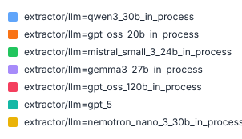
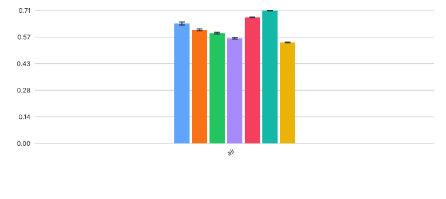
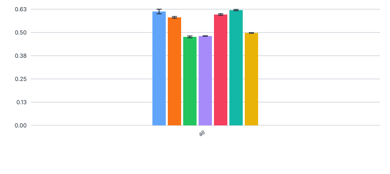
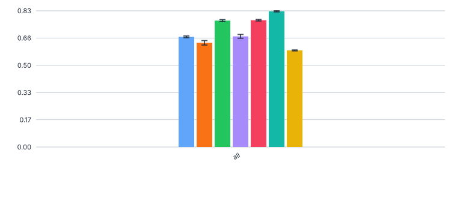
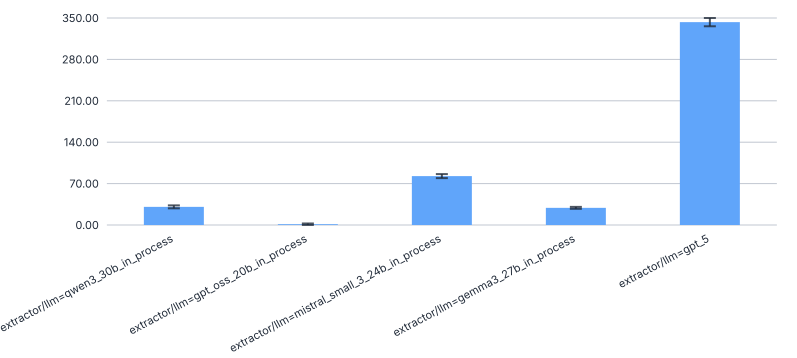

# 440_gpt_oss_120b_faktencheck_core

Evaluate `openai/gpt-oss-120b` with the chunking extractor on the Faktencheck core fields schema
(`faktencheck_core_fields_schema_with_chunking`), using the in-process vLLM config.
Goal: establish a performance baseline for a 120B-scale open-weights model and compare it against
smaller models already evaluated on this experiment.

## Config

Config file: `configs/extractor/llm/gpt_oss_120b_in_process.yaml`

### Non-default parameters

- `vllm_kwargs.max_model_len=65536`: overrides the vLLM default to cap the context window.
  `131072` requires ~5 GiB KV cache but only ~3.3 GiB is available on cluster GPUs, causing
  vLLM to refuse to start. `65536` was confirmed working on serv-3341 (2026-06-11).

## Prediction

```bash
./run_in_process.sh -pa "H100-SLT,H100-Trails,H100,H200,B200" -ng 1 \
  -u "-m kibad_llm.predict \
       name=440_gpt_oss_120b_faktencheck_core \
       experiment/predict=faktencheck_core_fields_schema_with_chunking \
       extractor/llm=gpt_oss_120b_in_process \
       pdf_directory=/ds/text/kiba-d/dev-set-100 \
       seed=42,1337,7331 \
       --multirun"
```

Result location: `logs/440_gpt_oss_120b_faktencheck_core/predict/multiruns/2026-06-23_16-45-33`

## Evaluation

### F1 scores

Run from within `data/prediction_results/`:

```bash
uv run -m kibad_llm.evaluate \
  name=440_gpt_oss_120b_faktencheck_core \
  experiment/evaluate=faktencheck_core_f1_micro_flat \
  prediction_logs=logs/440_gpt_oss_120b_faktencheck_core/predict/multiruns/2026-06-23_16-45-33 \
  dataset.references.file=../interim/faktencheck-db/faktenscheck_core_corrected.jsonl \
  "metric.fields=[habitat,biodiversity_level,ecosystem_type.term,ecosystem_type.category,taxa.species_group]" \
  --multirun
```

Result location: `logs/440_gpt_oss_120b_faktencheck_core/evaluate/multiruns/2026-06-24_15-16-42`

| field | seed=42 | seed=1337 | seed=7331 |
|---|---|---|---|
| habitat | 0.842 | 0.808 | 0.836 |
| ecosystem_type.category | 0.785 | 0.819 | 0.806 |
| ecosystem_type.term | 0.585 | 0.585 | 0.592 |
| biodiversity_level | 0.622 | 0.613 | 0.621 |
| taxa.species_group | 0.604 | 0.621 | 0.611 |
| **ALL** | **0.674** | **0.675** | **0.678** |
| **AVG** | **0.688** | **0.689** | **0.693** |



#### F1


#### Precision


#### Recall


### Errors

```bash
uv run -m kibad_llm.evaluate \
  name=440_gpt_oss_120b_faktencheck_core \
  experiment/evaluate=prediction_errors \
  hydra.callbacks.save_job_return.multirun_show_file_contents=null \
  prediction_logs=logs/440_gpt_oss_120b_faktencheck_core/predict/multiruns/2026-06-23_16-45-33 \
  --multirun
```

Result location: `logs/440_gpt_oss_120b_faktencheck_core/evaluate/multiruns/2026-06-24_15-17-01`

| seed | no_error | with_error | error type |
|---|---|---|---|
| 42 | 1650 | 4 | JSONDecodeError |
| 1337 | 1653 | 1 | JSONDecodeError |
| 7331 | 1650 | 4 | JSONDecodeError |




## Outcome

The error rate is very low: 1–4 `JSONDecodeError`s per seed out of ~1654 total chunks (~0.06–0.24%).
All errors are malformed JSON in the model output. No context-length errors were observed, confirming
that the default chunk size (20k characters) fits comfortably within `max_model_len=65536`.

gpt-oss-120b achieves the highest ALL F1 among all models evaluated on this experiment, with a mean
ALL F1 of **0.676** (5-field subset, corrected reference data). It leads on `habitat` (~0.84) and
`ecosystem_type.category` (~0.80), and is competitive on all other fields.
