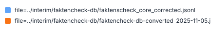
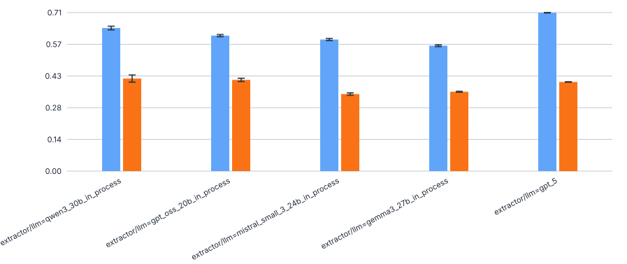
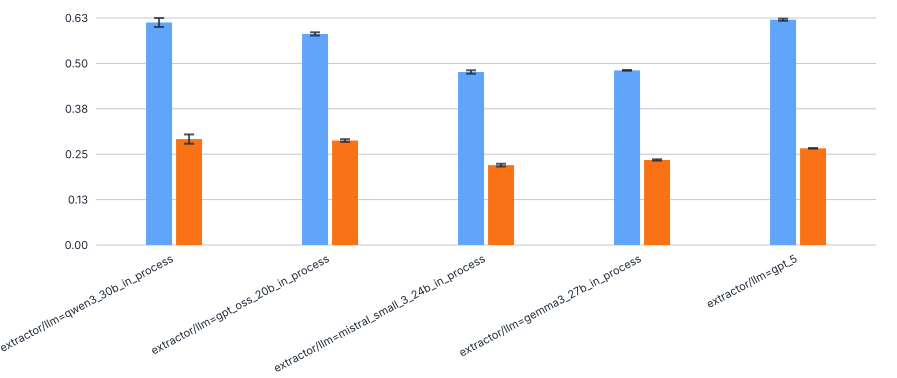
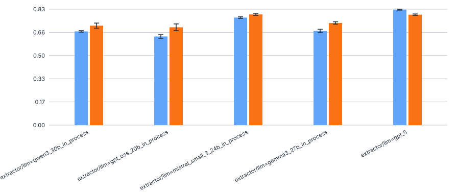
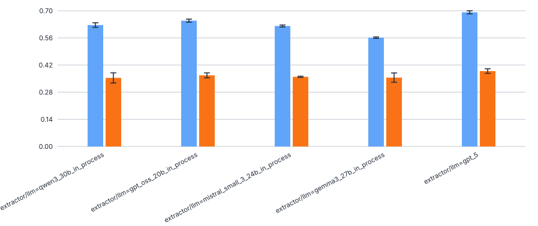
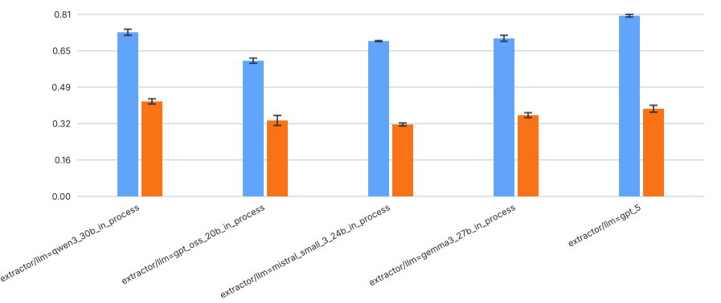
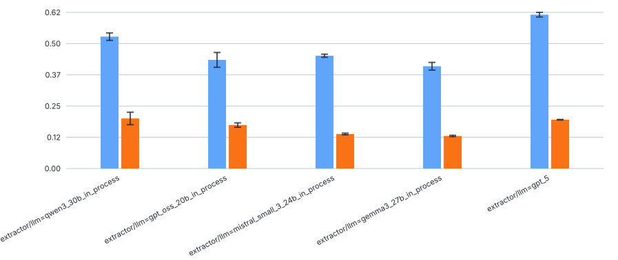
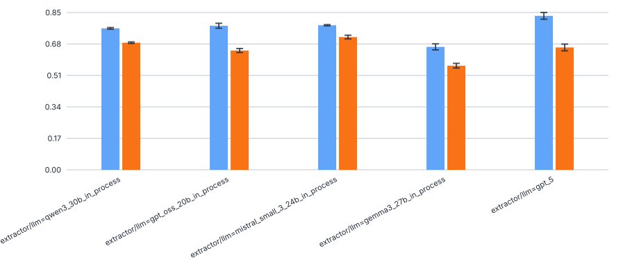
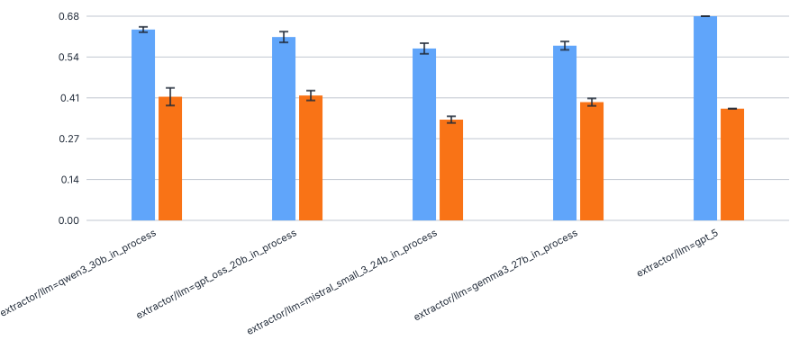

# 542_faktencheck_core

evaluation on only the best setup (with chunking, full dev set) from [397_faktencheck_core_v1_for_chunking](../397_faktencheck_core_v1_for_chunking), but against the old (not corrected) reference file `faktencheck-db-converted_2025-11-05.jsonl`

## f1

```
uv run -m kibad_llm.evaluate \
name=542_faktencheck_core \
experiment/evaluate=faktencheck_core_f1_micro_flat \
dataset.references.file=../interim/faktencheck-db/faktencheck-db-converted_2025-11-05.jsonl \
metric.fields=[habitat,biodiversity_level,ecosystem_type.term,ecosystem_type.category,taxa.species_group] \
hydra.callbacks.save_job_return.multirun_show_file_contents=null \
prediction_logs=[logs/397_faktencheck_core_v1_for_chunking/predict/multiruns/2026-04-02_15-50-22,logs/397_faktencheck_core_v1_for_chunking/predict/multiruns/2026-04-02_16-41-44,logs/397_faktencheck_core_v1_for_chunking/predict/multiruns/2026-04-08_19-02-33,logs/397_faktencheck_core_v1_for_chunking/predict/multiruns/2026-04-08_19-06-32,logs/397_faktencheck_core_v1_for_chunking/predict/multiruns/2026-04-08_20-34-00] \
--multirun
```

result location: `logs/542_faktencheck_core/evaluate/multiruns/2026-07-07_11-49-59`

## Comparison with new (corrected) reference file

Comparison data is from [519_faktencheck_core](../519_faktencheck_core). I simply loaded both folders into the eval-dashboard and **grouped only by `extractor/llm` (Predictions table) and `dataset.reference.file` (Evaluations table)**. The respective data can be found in the [figure_data/](figure_data) folder.



### F1



### Precision



### Recall



### F1 - biodiversity level



### F1 - ecosystem type - category



### F1 - ecosystem type - term



### F1 - habitat



### F1 - taxa - species group


