# 544_organism_trends_wald_corrected

uses same predictions as [428_organism_trends_with_chunking](../428_organism_trends_with_chunking) , but evaluated against the new (corrected) reference data ([Referenz_Wald_korrigiert_mit_IDs_ohne_deleted.csv](../../../external/organism_trends/Referenz_Wald_korrigiert_mit_IDs_ohne_deleted.csv))

## Evaluation
 - based on [428_organism_trends_with_chunking](../428_organism_trends_with_chunking)

### F1
 - all without `Untergruppe_RoteListen`

#### flattened
```Bash
uv run -m kibad_llm.evaluate \
name=544_organism_trends_wald_corrected \
experiment/evaluate=organism_trends_f1_micro_flat \
prediction_logs=logs/428_organism_trends_with_chunking/predict \
dataset.references.file=../external/organism_trends/Referenz_Wald_korrigiert_mit_IDs_ohne_deleted.csv \
hydra.callbacks.save_job_return.multirun_show_file_contents=null \
--multirun
```

result location: `logs/544_organism_trends_wald_corrected/evaluate/multiruns/2026-07-08_17-13-52`

#### full compounds

```Bash
uv run -m kibad_llm.evaluate \
name=544_organism_trends_wald_corrected \
experiment/evaluate=organism_trends_f1_micro \
prediction_logs=logs/428_organism_trends_with_chunking/predict \
dataset.references.file=../external/organism_trends/Referenz_Wald_korrigiert_mit_IDs_ohne_deleted.csv \
hydra.callbacks.save_job_return.multirun_show_file_contents=null \
--multirun
```

result location: `logs/544_organism_trends_wald_corrected/evaluate/multiruns/2026-07-08_17-14-16`

#### base elements

```Bash
uv run -m kibad_llm.evaluate \
name=544_organism_trends_wald_corrected \
experiment/evaluate=organism_trends_f1_micro_base_entries \
prediction_logs=logs/428_organism_trends_with_chunking/predict \
dataset.references.file=../external/organism_trends/Referenz_Wald_korrigiert_mit_IDs_ohne_deleted.csv \
hydra.callbacks.save_job_return.multirun_show_file_contents=null \
--multirun
```

result location: `logs/544_organism_trends_wald_corrected/evaluate/multiruns/2026-07-08_17-14-46`

#### `Antwortvariable` conditioned on base elements

```Bash
uv run -m kibad_llm.evaluate \
name=544_organism_trends_wald_corrected \
experiment/evaluate=organism_trends_f1_micro_conditional_variable_only \
prediction_logs=logs/428_organism_trends_with_chunking/predict \
dataset.references.file=../external/organism_trends/Referenz_Wald_korrigiert_mit_IDs_ohne_deleted.csv \
hydra.callbacks.save_job_return.multirun_show_file_contents=null \
--multirun
```

result location: `logs/544_organism_trends_wald_corrected/evaluate/multiruns/2026-07-08_17-15-07`

#### `Antwortvariable` & `Trend` conditioned on base elements

```Bash
uv run -m kibad_llm.evaluate \
name=544_organism_trends_wald_corrected \
experiment/evaluate=organism_trends_f1_micro_conditional_variable_and_trend \
prediction_logs=logs/428_organism_trends_with_chunking/predict \
dataset.references.file=../external/organism_trends/Referenz_Wald_korrigiert_mit_IDs_ohne_deleted.csv \
hydra.callbacks.save_job_return.multirun_show_file_contents=null \
--multirun
```

result location: `logs/544_organism_trends_wald_corrected/evaluate/multiruns/2026-07-08_17-15-29`

## Comparison with old (not corrected) reference data

- comparison data from [428_organism_trends_with_chunking](../428_organism_trends_with_chunking) (`file=`)


### organism_trends_f1_micro-ALL

#### f1

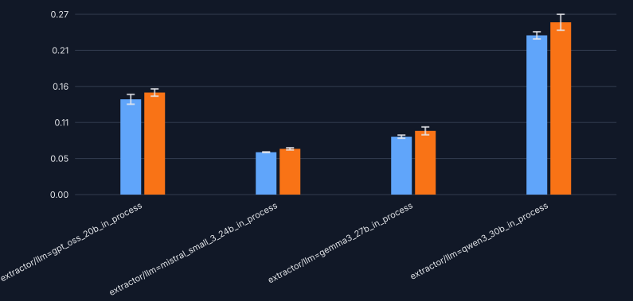

#### precision

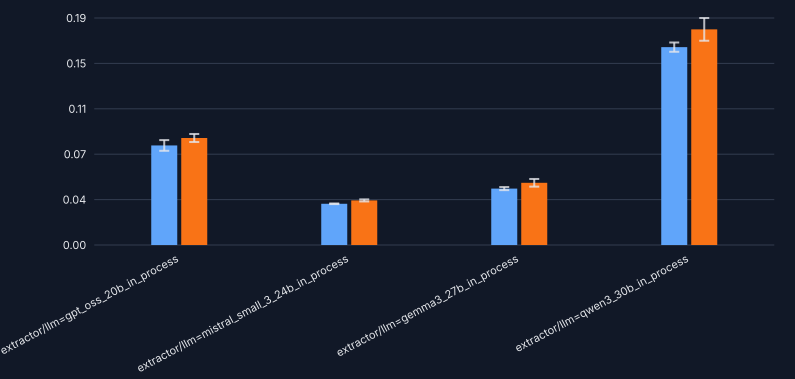

#### recall

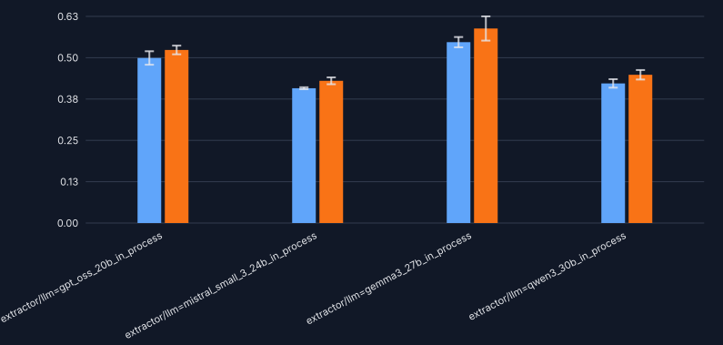

#### support

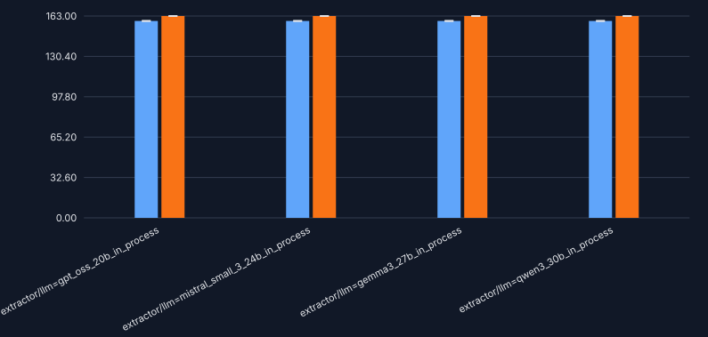

### organism_trends_f1_micro_base_entries-ALL

#### f1

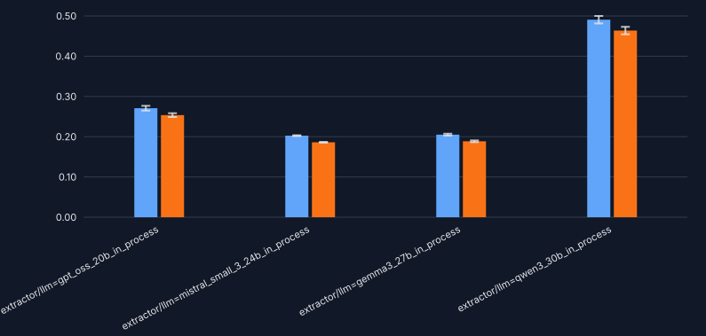

#### precision

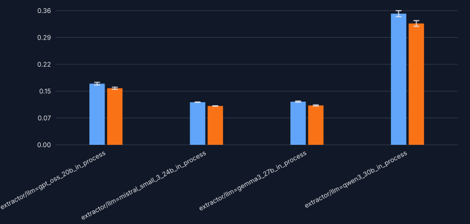

#### recall

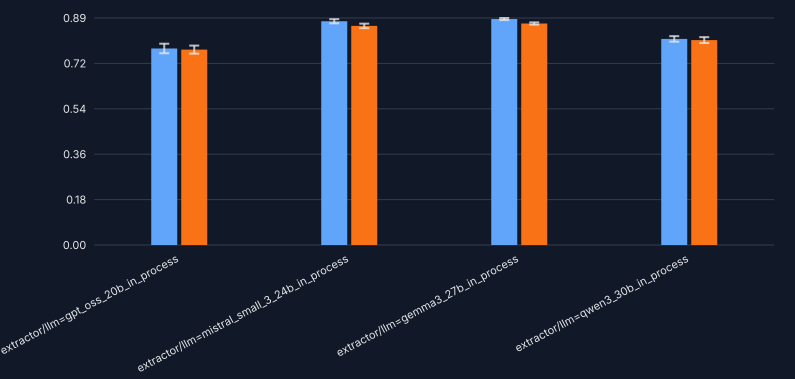

#### support

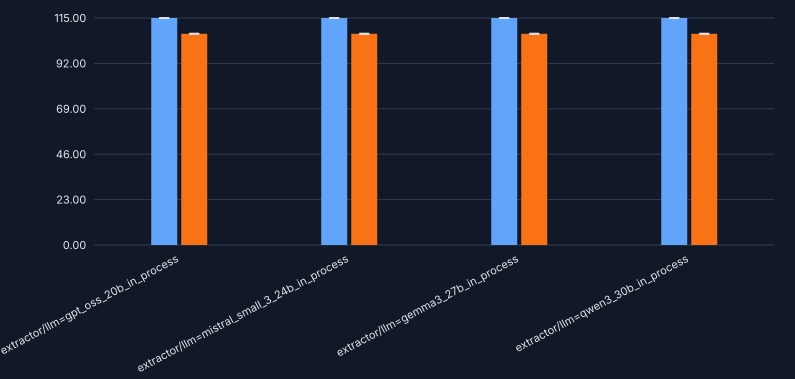

### organism_trends_f1_micro_conditional_variable_and_trend-ALL

#### f1

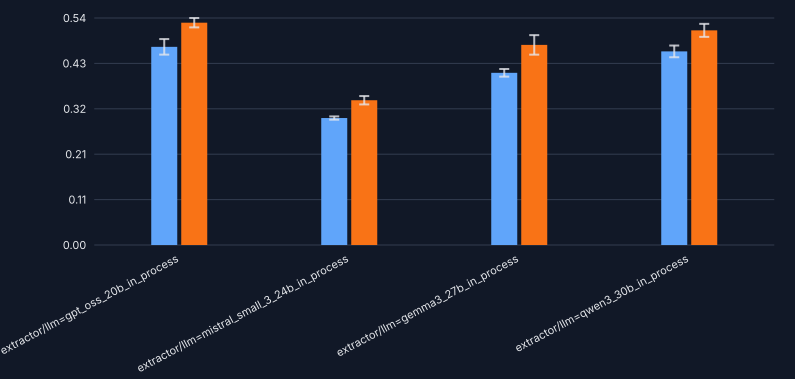

#### precision

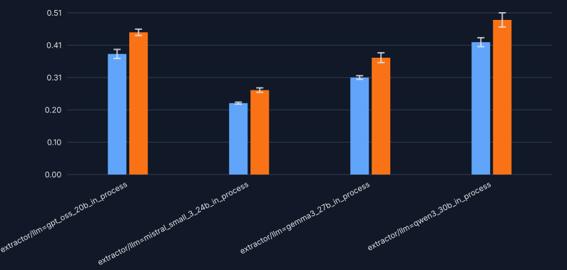

#### recall

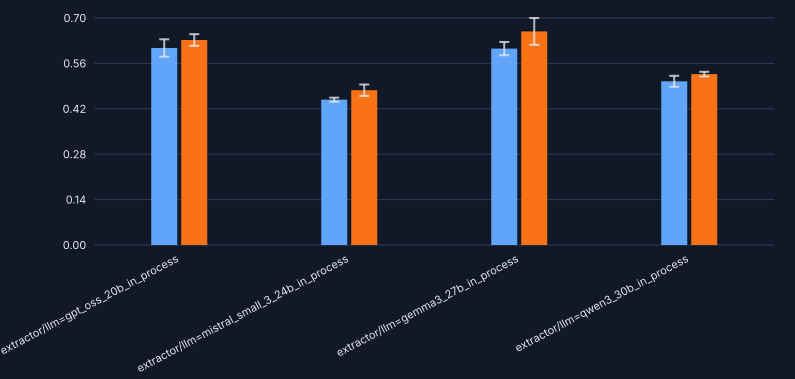

#### support

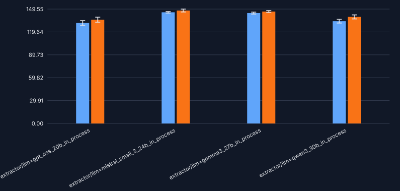

