# 586_organism_trends_bestconfig_testset_rerun

Evaluation of the best setup (with chunking) from [549_organism_trends_bestconfig_testset](../549_organism_trends_bestconfig_testset), 
but with a fixed prompt template `organism_trends_v1_with_chunking_AuO.yaml`. 

The prediction runs in [#549](../549_organism_trends_bestconfig_testset) and [#574](../574_gpt5_organism_trends_testset) on the 
OrganismTrend test set for the 'Agrarian and open spaces' habitat used the prompt template organism_trends_v1_with_chunking, 
which unfortunately contains some 'Wald' habitat specific text. In addition, a total of 11 PDF files mentioned in the test reference 
file were missing, similar to the validation set.

This folder contains reruns the OrganismTrend schema experiments for the journal publication with the LLMs Gemma, Qwen, 
GPT OSS, and Mistral, plus GPT5. It follows [#574](../574_gpt5_organism_trends_testset) for GPT5 and 
[#549](../549_organism_trends_bestconfig_testset), but changes the prompt template to 'organism_trends_v1_with_chunking_AuO.yaml'
and adds predictions for the 11 missing PDFs.

## Prediction

Base for the commands are https://github.com/DFKI-NLP/kibad-llm/tree/main/data/prediction_results/logs/549_organism_trends_bestconfig_testset
and https://github.com/DFKI-NLP/kibad-llm/tree/main/data/prediction_results/logs/574_gpt5_organism_trends_testset

### gpt_oss_20b

```sh
./run_in_process.sh -t "3-00:00:00" -pa "H100-SLT,H100,H200,B200,A100-80GB"  \
-u "-m kibad_llm.predict \
name=586_organism_trends_bestconfig_testset_rerun \
experiment/predict=organism_trends_with_chunking \
extractor/prompt_template=organism_trends_v1_with_chunking_AuO \
pdf_directory=/ds/text/kiba-d/test-set-AuO-WVC \
extractor/llm=gpt_oss_20b_in_process \
seed=42,1337,7331 \
--multirun"
```

```sh
=============================================
>>> USING PARTITION H100-Trails,H100-SLT,H100,H200,B200,A100-80GB
>>> MAX TIME 3-00:00:00
>>> SUBMITTED Thu Aug 27 03:32:04 PM CEST 2026
>>> UV_ARGS --cache-dir /netscratch/hennig/cache/uv -m kibad_llm.predict name=586_organism_trends_bestconfig_testset_rerun experiment/predict=organism_trends_with_chunking extractor/prompt_template=organism_trends_v1_with_chunking_AuO pdf_directory=/ds/text/kiba-d/test-set-AuO-WVC extractor/llm=gpt_oss_20b_in_process seed=42,1337,7331 --multirun
>>> JOB_NAME kiba-d_ddf9f2db-b666-4822-b4e3-d3ae1977997b
>>> GIT_REF (none; using current working tree)
=============================================
```

Saved to `logs/586_organism_trends_bestconfig_testset_rerun/predict/multiruns/2026-08-27_15-37-27`

### gemma3_27b

**IMPORTANT: Running this requires a huggingface token**

```sh
./run_in_process.sh -t "3-00:00:00" -pa "H100-SLT,H100,H200,B200,A100-80GB"  \
-u "-m kibad_llm.predict \
name=586_organism_trends_bestconfig_testset_rerun \
experiment/predict=organism_trends_with_chunking \
extractor/prompt_template=organism_trends_v1_with_chunking_AuO \
pdf_directory=/ds/text/kiba-d/test-set-AuO-WVC \
extractor/llm=gemma3_27b_in_process \
seed=42,1337,7331 \
--multirun"
```

```sh
=============================================
>>> USING PARTITION H100-Trails,H100-SLT,H100,H200,B200,A100-80GB
>>> MAX TIME 3-00:00:00
>>> SUBMITTED Thu Aug 27 03:32:06 PM CEST 2026
>>> UV_ARGS --cache-dir /netscratch/hennig/cache/uv -m kibad_llm.predict name=586_organism_trends_bestconfig_testset_rerun experiment/predict=organism_trends_with_chunking extractor/prompt_template=organism_trends_v1_with_chunking_AuO pdf_directory=/ds/text/kiba-d/test-set-AuO-WVC extractor/llm=gemma3_27b_in_process seed=42,1337,7331 --multirun
>>> JOB_NAME kiba-d_b64fba76-2527-4dd3-8a59-bd5220fd0866
>>> GIT_REF (none; using current working tree)
=============================================
```

Saved to `logs/586_organism_trends_bestconfig_testset_rerun/predict/multiruns/2026-08-27_15-41-52`

### qwen3_30b

```sh
./run_in_process.sh -t "3-00:00:00" -pa "H100-SLT,H100,H200,B200,A100-80GB"  \
-u "-m kibad_llm.predict \
name=586_organism_trends_bestconfig_testset_rerun \
experiment/predict=organism_trends_with_chunking \
extractor/prompt_template=organism_trends_v1_with_chunking_AuO \
pdf_directory=/ds/text/kiba-d/test-set-AuO-WVC \
extractor/llm=qwen3_30b_in_process \
seed=42,1337,7331 \
--multirun"
```

```sh
=============================================
>>> USING PARTITION H100-Trails,H100-SLT,H100,H200,B200,A100-80GB
>>> MAX TIME 3-00:00:00
>>> SUBMITTED Thu Aug 27 03:32:08 PM CEST 2026
>>> UV_ARGS --cache-dir /netscratch/hennig/cache/uv -m kibad_llm.predict name=586_organism_trends_bestconfig_testset_rerun experiment/predict=organism_trends_with_chunking extractor/prompt_template=organism_trends_v1_with_chunking_AuO pdf_directory=/ds/text/kiba-d/test-set-AuO-WVC extractor/llm=qwen3_30b_in_process seed=42,1337,7331 --multirun
>>> JOB_NAME kiba-d_e9f1871e-98b7-4b61-89ae-f6beee4ad59d
>>> GIT_REF (none; using current working tree)
=============================================
```

Saved to `logs/586_organism_trends_bestconfig_testset_rerun/predict/multiruns/2026-08-27_16-03-08`

### mistral_small_3_24b

```sh
./run_in_process.sh -t "3-00:00:00" -pa "H100-SLT,H100,H200,B200,A100-80GB"  \
-u "-m kibad_llm.predict \
name=586_organism_trends_bestconfig_testset_rerun \
experiment/predict=organism_trends_with_chunking \
extractor/prompt_template=organism_trends_v1_with_chunking_AuO \
pdf_directory=/ds/text/kiba-d/test-set-AuO-WVC \
extractor/llm=mistral_small_3_24b_in_process \
seed=42,1337,7331 \
--multirun"
```

```sh
=============================================
>>> USING PARTITION H100-Trails,H100-SLT,H100,H200,B200,A100-80GB
>>> MAX TIME 3-00:00:00
>>> SUBMITTED Thu Aug 27 03:32:10 PM CEST 2026
>>> UV_ARGS --cache-dir /netscratch/hennig/cache/uv -m kibad_llm.predict name=586_organism_trends_bestconfig_testset_rerun experiment/predict=organism_trends_with_chunking extractor/prompt_template=organism_trends_v1_with_chunking_AuO pdf_directory=/ds/text/kiba-d/test-set-AuO-WVC extractor/llm=mistral_small_3_24b_in_process seed=42,1337,7331 --multirun
>>> JOB_NAME kiba-d_c2b23a30-134d-4142-9e63-5e82107d9ead
>>> GIT_REF (none; using current working tree)
=============================================
```

Saved to `logs/586_organism_trends_bestconfig_testset_rerun/predict/multiruns/2026-08-27_16-06-57`

### gpt_5

**IMPORTANT: Running this requires an openai token**  
This run does not need a gpu and is hence run with `-ng 0. It is also run with only a single seed to limit costs, and 
since the random seed would not change anything on the OpenAI side anyways.

```sh
./run_in_process.sh -t "3-00:00:00" -ng 0 -pa "H100-SLT,H100,H200,B200,A100-80GB,batch"  \
-u "-m kibad_llm.predict \
name=586_organism_trends_bestconfig_testset_rerun \
experiment/predict=organism_trends_with_chunking \
extractor/prompt_template=organism_trends_v1_with_chunking_AuO \
pdf_directory=/ds/text/kiba-d/test-set-AuO-WVC \
extractor/llm=gpt_5 \
seed=42 \
--multirun"
```

```sh

```

Saved to `logs/586_organism_trends_bestconfig_testset_rerun/predict/multiruns/2026-09-02_08-11-01`

## Evaluation

### F1, P, R
Base for the command is https://github.com/DFKI-NLP/kibad-llm/tree/main/data/prediction_results/logs/549_organism_trends_bestconfig_testset

##### flattened
```sh
uv run -m kibad_llm.evaluate \
name=586_organism_trends_bestconfig_testset_rerun \
experiment/evaluate=organism_trends_f1_micro_flat \
prediction_logs=logs/586_organism_trends_bestconfig_testset_rerun/predict \
hydra.callbacks.save_job_return.multirun_show_file_contents=null \
dataset.references.file="../external/organism_trends/Weighted Vote Count Agrar- und Offenland Literatur - Sheet1.csv" \
--multirun
```

Saved to `logs/586_organism_trends_bestconfig_testset_rerun/evaluate/multiruns/2026-09-03_14-45-55`

##### full compounds

```sh
uv run -m kibad_llm.evaluate \
name=586_organism_trends_bestconfig_testset_rerun \
experiment/evaluate=organism_trends_f1_micro \
prediction_logs=logs/586_organism_trends_bestconfig_testset_rerun/predict \
hydra.callbacks.save_job_return.multirun_show_file_contents=null \
dataset.references.file="../external/organism_trends/Weighted Vote Count Agrar- und Offenland Literatur - Sheet1.csv" \
--multirun
```

Saved to `logs/586_organism_trends_bestconfig_testset_rerun/evaluate/multiruns/2026-09-03_14-46-39`

##### base elements

```sh
uv run -m kibad_llm.evaluate \
name=586_organism_trends_bestconfig_testset_rerun \
experiment/evaluate=organism_trends_f1_micro_base_entries \
prediction_logs=logs/586_organism_trends_bestconfig_testset_rerun/predict \
hydra.callbacks.save_job_return.multirun_show_file_contents=null \
dataset.references.file="../external/organism_trends/Weighted Vote Count Agrar- und Offenland Literatur - Sheet1.csv" \
--multirun
```

Saved to `logs/586_organism_trends_bestconfig_testset_rerun/evaluate/multiruns/2026-09-03_14-47-02`

##### `Antwortvariable` conditioned on base elements

```sh
uv run -m kibad_llm.evaluate \
name=586_organism_trends_bestconfig_testset_rerun \
experiment/evaluate=organism_trends_f1_micro_conditional_variable_only \
prediction_logs=logs/586_organism_trends_bestconfig_testset_rerun/predict \
hydra.callbacks.save_job_return.multirun_show_file_contents=null \
dataset.references.file="../external/organism_trends/Weighted Vote Count Agrar- und Offenland Literatur - Sheet1.csv" \
--multirun
```

Saved to `logs/586_organism_trends_bestconfig_testset_rerun/evaluate/multiruns/2026-09-03_14-47-26`

##### `Antwortvariable` & `Trend` conditioned on base elements

```sh
uv run -m kibad_llm.evaluate \
name=586_organism_trends_bestconfig_testset_rerun \
experiment/evaluate=organism_trends_f1_micro_conditional_variable_and_trend \
prediction_logs=logs/586_organism_trends_bestconfig_testset_rerun/predict \
hydra.callbacks.save_job_return.multirun_show_file_contents=null \
dataset.references.file="../external/organism_trends/Weighted Vote Count Agrar- und Offenland Literatur - Sheet1.csv" \
--multirun
```

Saved to `logs/586_organism_trends_bestconfig_testset_rerun/evaluate/multiruns/2026-09-03_14-47-44`

### Errors

```sh
uv run -m kibad_llm.evaluate \
name=586_organism_trends_bestconfig_testset_rerun \
experiment/evaluate=prediction_errors \
hydra.callbacks.save_job_return.multirun_show_file_contents=null \
prediction_logs=[\
logs/586_organism_trends_bestconfig_testset_rerun/predict \
] \
--multirun
```

Saved to `logs/586_organism_trends_bestconfig_testset_rerun/evaluate/multiruns/2026-09-03_14-48-04`

## Outcome

### F1, P, R

The results in this folder can serve as a basis for the [Journal experiments](https://github.com/DFKI-NLP/kibad-llm/issues/521),
namely for the Organism Trend schema plots:

#### flattened

Legend


Micro-F1 (ALL.f1)

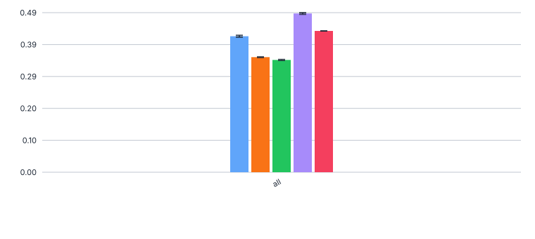 

Micro-Precision (ALL.precision)

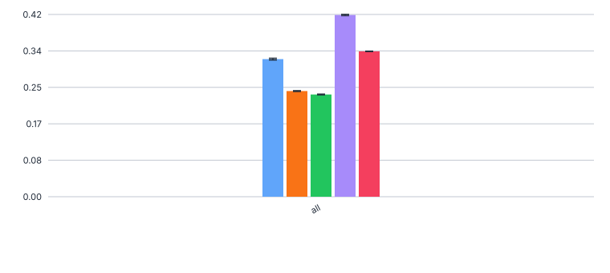

Micro-Recall (ALL.recall)

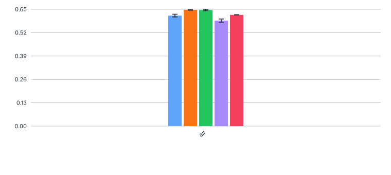

Notes
- Micro-F1 on the flatted schema (per-field evaluation)  - Qwen best with 0.489
- Qwen has very good precision at 0.42, all other models much lower
- Recall is similar across models (0.58-0.64)
- Compared to [#574](../574_gpt5_organism_trends_testset) for GPT5 and 
[#549](../549_organism_trends_bestconfig_testset), F1 scores improve by 4-5 points for all open-source LLMs, and 
  about 1 point for GPT5

#### full compounds

Legend


Micro-F1 (ALL.f1)

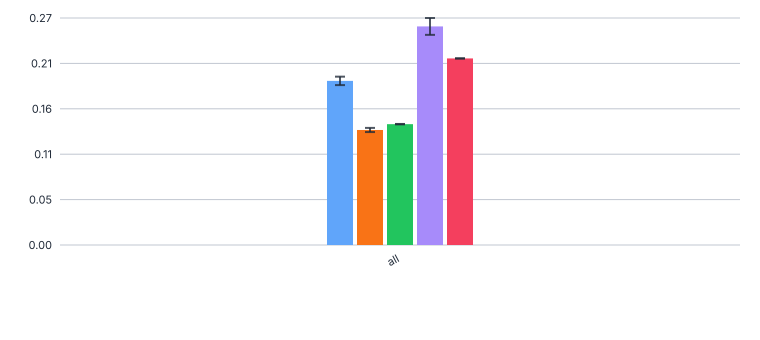 

Micro-Precision (ALL.precision)

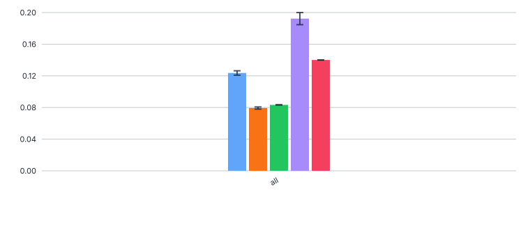

Micro-Recall (ALL.recall)

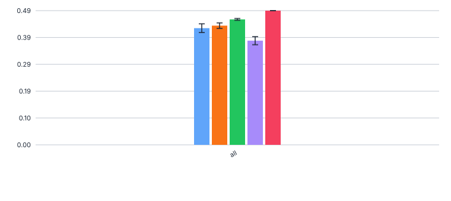

Notes
- F1 scores range from 0.255 (Qwen3) to 0.134 (Mistral)
- Compared to [#574](../574_gpt5_organism_trends_testset) for GPT5 and 
[#549](../549_organism_trends_bestconfig_testset), F1 scores improve by 7-12 points for all open-source LLMs, and 
  about 2 points for GPT5

#### base elements

Legend


Micro-F1 (ALL.f1)

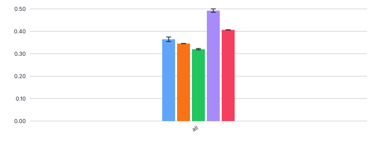 

Micro-Precision (ALL.precision)

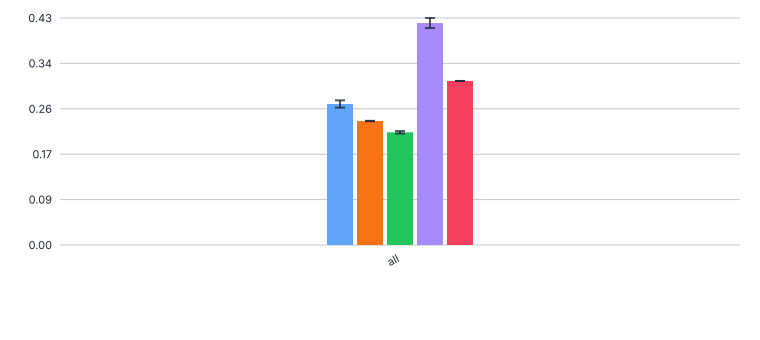

Micro-Recall (ALL.recall)

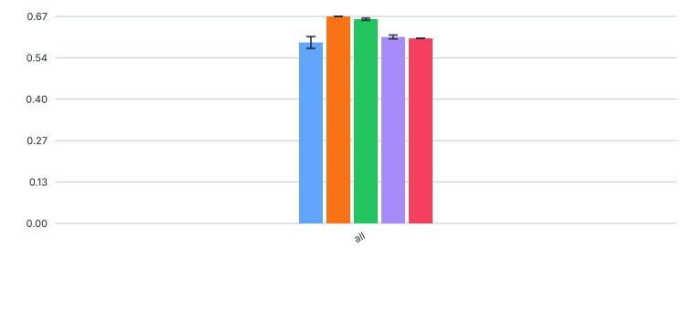

Notes
- Qwen3 best at 0.496, Gemma worst at 0.323. Mostly due to much better precision, i.e. less over-prediction
- Compared to [#574](../574_gpt5_organism_trends_testset) for GPT5 and 
[#549](../549_organism_trends_bestconfig_testset), F1 scores improve by 15-27 points for all open-source LLMs, and 
  about 7 points for GPT5

#### `Antwortvariable` conditioned on base elements

Legend


F1

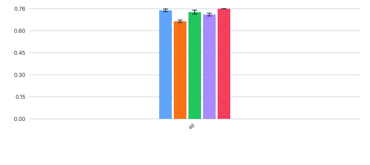 

Precision

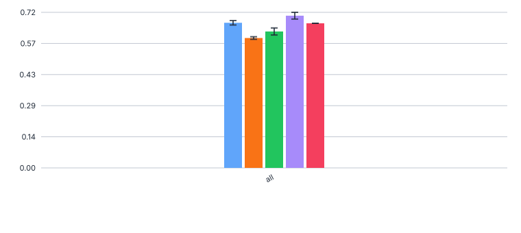

Recall

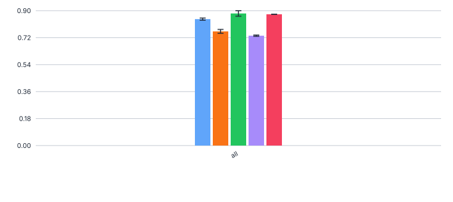

Notes
- All models quite good at 0.67-0.75
- Compared to [#574](../574_gpt5_organism_trends_testset) for GPT5 and 
[#549](../549_organism_trends_bestconfig_testset), F1 scores is on par or up to 2-3 points lower

#### `Antwortvariable` & `Trend` conditioned on base elements

Legend


F1

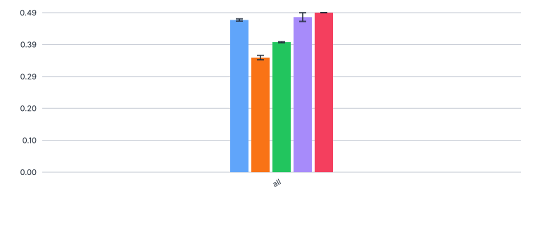 

Precision

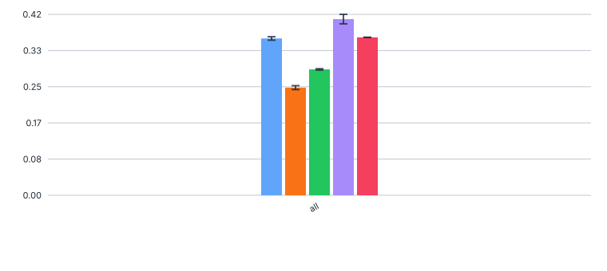

Recall

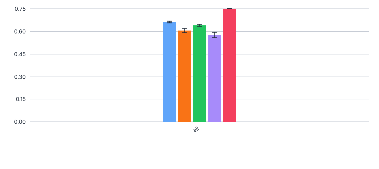

Notes
- Mistral worst at F1=0.35, GPT5 best at 0.49, Qwen3 at 0.48
- Compared to [#574](../574_gpt5_organism_trends_testset) for GPT5 and 
[#549](../549_organism_trends_bestconfig_testset), F1 scores is on par or up to 2-5 points lower

### Errors


### no error

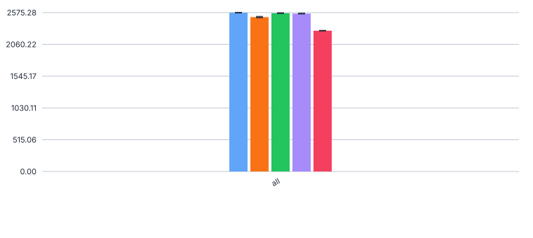

### with error

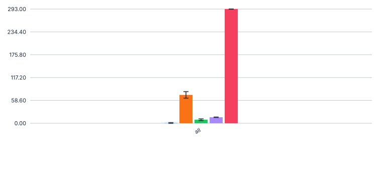

Notes
- GPT5 has reasoning parse errors (293, 2282 correct, so approx 10%) 
- "ReasoningExtractionError: Could not find any ThinkingBlock content in chat response. Did you enable reasoning summaries via OpenAI Response API?"

