# 587_UnionChunkingExtractor

This is the evaluation of the newly introduced MultiPassExtractor. 
The schema used is a split version of faktencheck_core_v1, to make the evaluation comparable to previous evaluations, with focus on the introduction of the ChunkingExtractor.
The expectation is for the MultiPassExtractor to perform about on par or better than the ChunkingExtractor. 
In the future, the MultiPassExtractor is not supposed to do the same extractions as the ChunkingExtractor, just with less to extract per iteration. Instead it should allow us to extract even more, using bigger over-all schemas (in smaller sub-schemas), than the ChunkingExtractor.

## Prediction

```sh
./run_in_process.sh -t "2-00:00:00" -pa "H100-SLT,H100-Trails,H100,H200,B200,A100-80GB" -sr \
  -r 65d5ae263f1b8ba7e9a57bff7d5f4a0aa093e537 \
  -u "-m kibad_llm.predict \
  name=587_MultiPassExtractor \
  extractor=multi_pass \
  extractor/prompt_template=faktencheck_core_v1_with_chunking \
  'extractor.overrides={habitat:{schema:{_target_:kibad_llm.schema.types.EcosystemStudyFeaturesHabitat.model_json_schema,by_alias:false}},taxa:{schema:{_target_:kibad_llm.schema.types.EcosystemStudyFeaturesTaxa.model_json_schema,by_alias:false}},biodiversity_level:{schema:{_target_:kibad_llm.schema.types.EcosystemStudyFeaturesBiodiversityLevel.model_json_schema,by_alias:false}},ecosystem_type:{schema:{_target_:kibad_llm.schema.types.EcosystemStudyFeaturesEcosystemType.model_json_schema,by_alias:false}}}' \
  pdf_directory=/ds/text/kiba-d/dev-set-100/ \
  extractor/llm=gpt_oss_20b_in_process \
  seed=42,1337,7331 \
  --multirun"
```

result location: `logs/587_UnionChunkingExtractor/predict/multiruns/2026-09-10_13-11-55-547617`

## Evaluation

### F1, P, R

```sh
uv run -m kibad_llm.evaluate \
  name=587_MultiPassExtractor \
  experiment/evaluate=faktencheck_core_f1_micro_flat \
  dataset.references.file=../interim/faktencheck-db/faktenscheck_core_corrected.jsonl \
  metric.fields=[habitat,biodiversity_level,ecosystem_type.term,ecosystem_type.category,taxa.species_group] \
  hydra.callbacks.save_job_return.multirun_show_file_contents=null \
  prediction_logs=logs/587_MultiPassExtractor/predict \
  --multirun
```

result location: `logs/587_UnionChunkingExtractor/evaluate/multiruns/2026-09-14_13-09-00-808991/`

<!--  -->

### F1

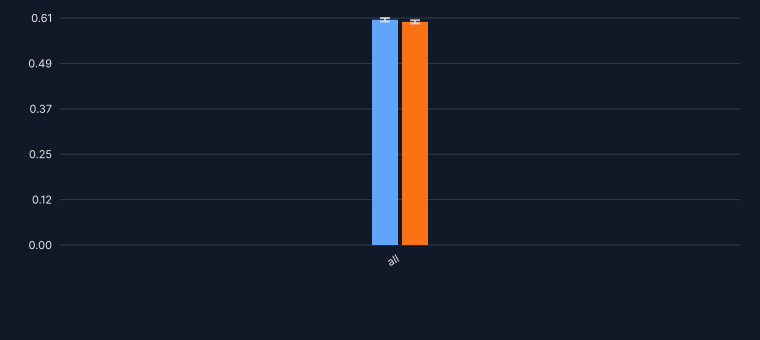

### Precision

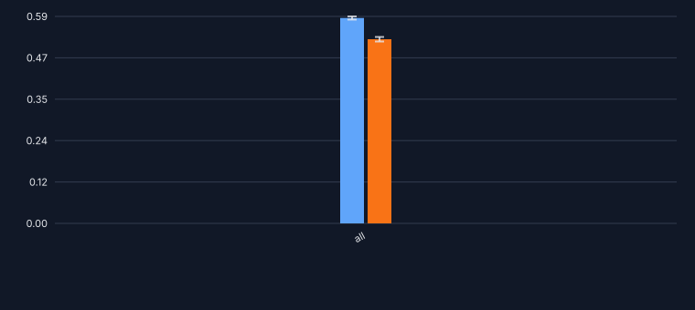

### Recall

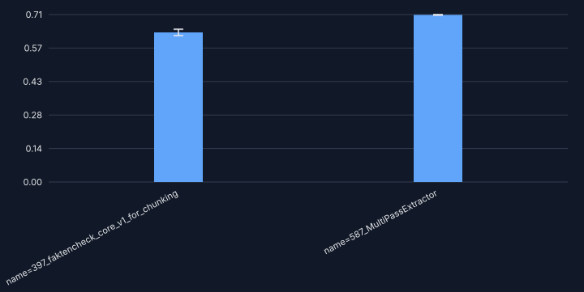

### F1 - biodiversity level

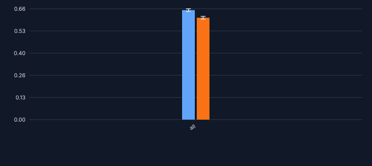

### F1 - ecosystem type - category

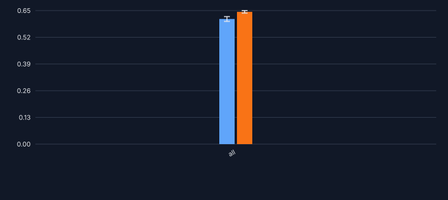

### F1 - ecosystem type - term

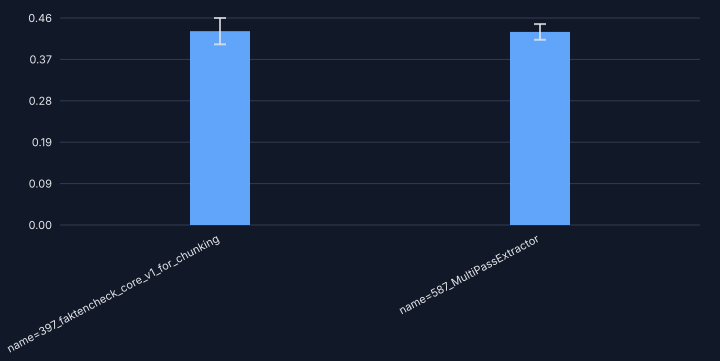

### F1 - habitat

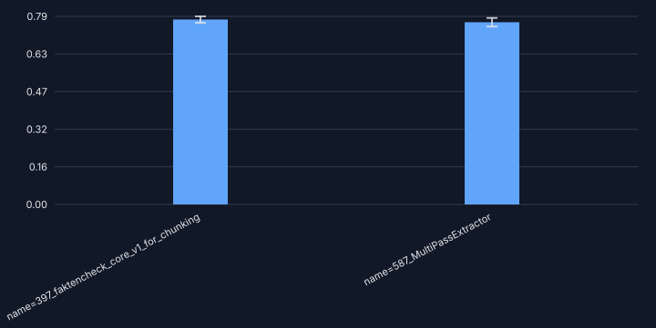

### F1 - taxa - species group

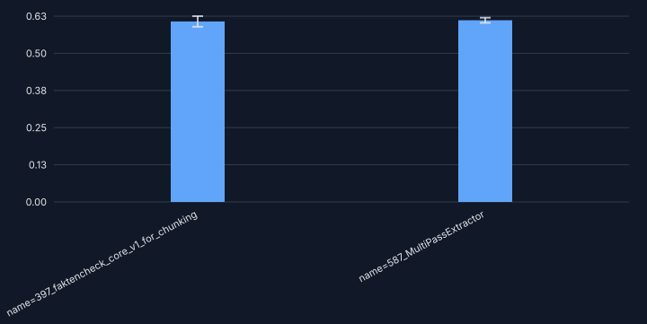

### Errors

```sh
uv run -m kibad_llm.evaluate \
  name=587_MultiPassExtractor \
  experiment/evaluate=prediction_errors \
  hydra.callbacks.save_job_return.multirun_show_file_contents=null \
  prediction_logs=logs/587_MultiPassExtractor/predict \
  --multirun
```

result location: `logs/587_UnionChunkingExtractor/evaluate/multiruns/2026-09-14_13-15-12-090274`

<!-- 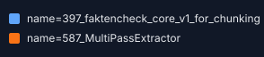 -->

### no error

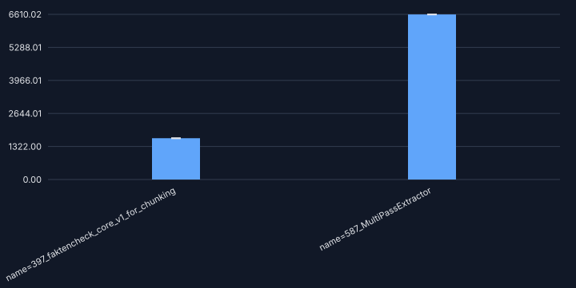

### with error

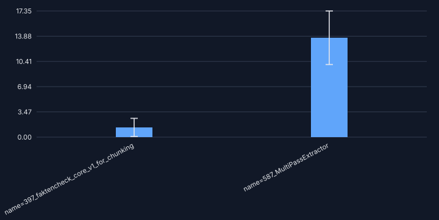

### details - JSONDecodeError

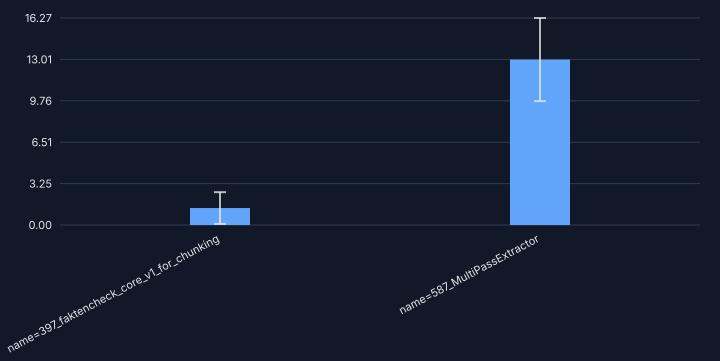

### details - MissingResponseContentError

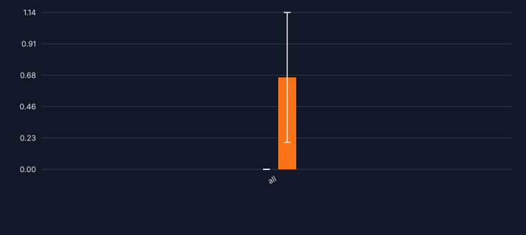

## Outcome

The performance is about the same as the ChunkingExtractor, which points towards the code being correct.
