# 587_UnionChunkingExtractor

TODO: goal, motivation, hypothesis.

## Prediction

```sh
./run_in_process.sh -t "1-00:00:00" -pa "H100-SLT,H100-Trails,H100,H200,B200,A100-80GB" -sr \
  -r c34ce0ad98586dc5f9b9400270bf28569b541e59 \
  -u "-m kibad_llm.predict \
  name=587_UnionChunkingExtractor \
  experiment/predict=faktencheck_core_fields_schema_with_union \
  pdf_directory=/ds/text/kiba-d/dev-set-100/ \
  extractor/llm=gpt_oss_20b_in_process \
  seed=42,1337,7331 \
  --multirun"
```

result location: `logs/587_UnionChunkingExtractor/predict/multiruns/2026-08-23_15-04-56`

## Evaluation

### F1, P, R

```sh
uv run -m kibad_llm.evaluate \
  name=587_UnionChunkingExtractor \
  experiment/evaluate=faktencheck_core_f1_micro_flat \
  dataset.references.file=../interim/faktencheck-db/faktenscheck_core_corrected.jsonl \
  metric.fields=[habitat,biodiversity_level,ecosystem_type.term,ecosystem_type.category,taxa.species_group] \
  hydra.callbacks.save_job_return.multirun_show_file_contents=null \
  prediction_logs=logs/587_UnionChunkingExtractor/predict \
  --multirun
```

result location: `logs/587_UnionChunkingExtractor/evaluate/multiruns/2026-08-25_10-15-25/`


### F1

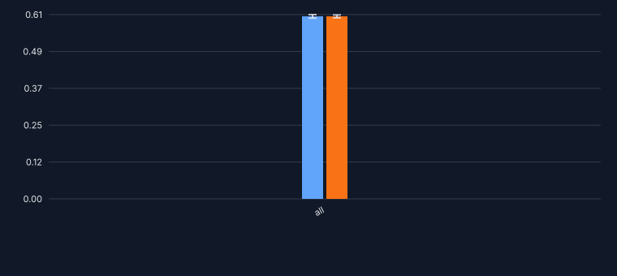

### Precision

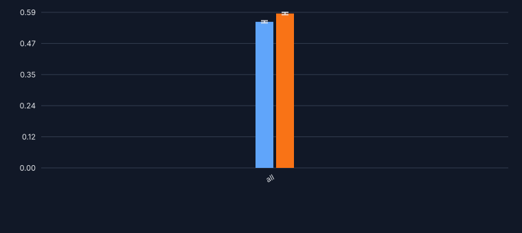

### Recall

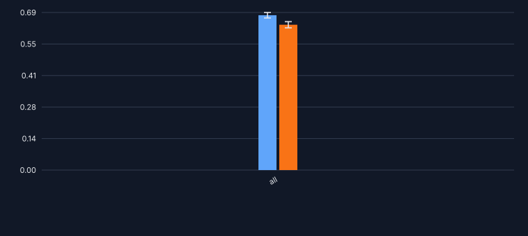

### F1 - biodiversity level

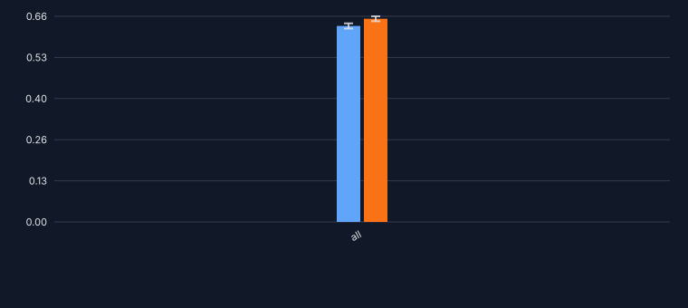

### F1 - ecosystem type - category


### F1 - ecosystem type - term

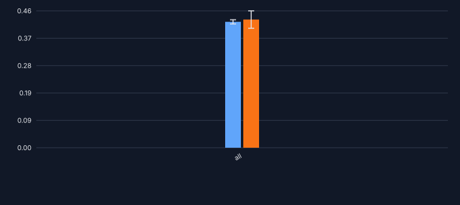

### F1 - habitat

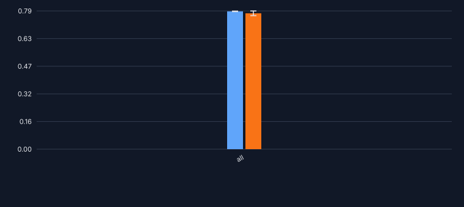

### F1 - taxa - species group

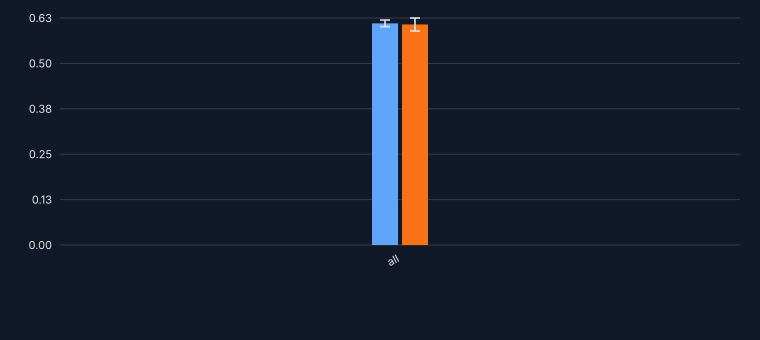

### Errors

```sh
uv run -m kibad_llm.evaluate \
  name=587_UnionChunkingExtractor \
  experiment/evaluate=prediction_errors \
  hydra.callbacks.save_job_return.multirun_show_file_contents=null \
  prediction_logs=logs/587_UnionChunkingExtractor/predict \
  --multirun
```

result location: `logs/587_UnionChunkingExtractor/evaluate/multiruns/2026-08-25_10-18-04`

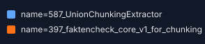

### no error

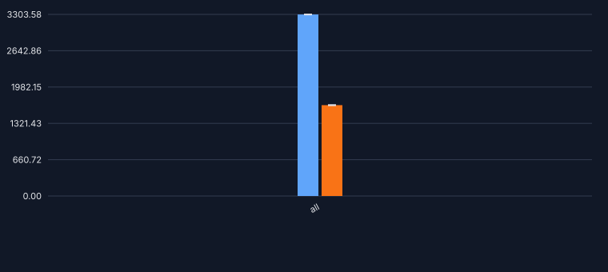

### with error

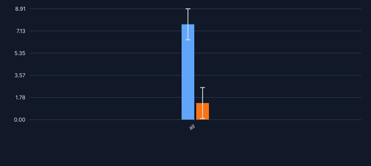

### details - JSONDecodeError

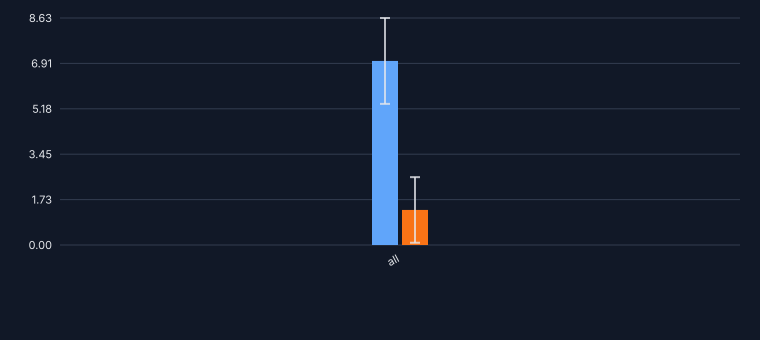

### details - MissingResponseContentError

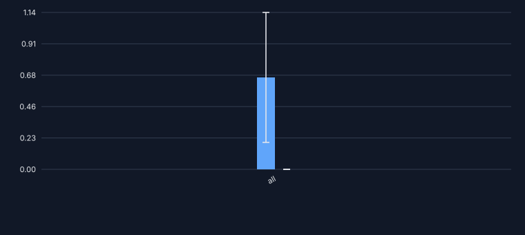

## Outcome

TODO: result analysis, hypothesis evaluation, unexpected outcomes, recommendations.
