# 591_organism_trends_bestconfig_devset_rerun

Evaluation of the best setup (with chunking) from [428_organism_trends_with_chunking](../428_organism_trends_with_chunking), 
but with the full set of input PDFs (59 files were missing) and the corrected reference file as in [544_organism_trends_with_chunking](../544_organism_trends_with_chunking). 

## Prediction

Base for the commands are https://github.com/DFKI-NLP/kibad-llm/tree/main/data/prediction_results/logs/428_organism_trends_with_chunking
and https://github.com/DFKI-NLP/kibad-llm/tree/main/data/prediction_results/logs/574_gpt5_organism_trends

### gpt_oss_20b

```sh
./run_in_process.sh -t "3-00:00:00" -pa "H100-Trails,H100-SLT,H100,H200,B200,A100-80GB"  \
-u "-m kibad_llm.predict \
name=591_organism_trends_bestconfig_devset_rerun \
experiment/predict=organism_trends_with_chunking \
pdf_directory=/ds/text/kiba-d/dev-set-Wald-WVC \
extractor/llm=gpt_oss_20b_in_process \
seed=42,1337,7331 \
--multirun"
```

```sh
=============================================
>>> USING PARTITION H100-Trails,H100-SLT,H100,H200,B200,A100-80GB
>>> MAX TIME 3-00:00:00
>>> SUBMITTED Thu Aug 27 05:16:46 PM CEST 2026
>>> UV_ARGS --cache-dir /netscratch/hennig/cache/uv -m kibad_llm.predict name=591_organism_trends_bestconfig_devset_rerun experiment/predict=organism_trends_with_chunking pdf_directory=/ds/text/kiba-d/dev-set-Wald-WVC extractor/llm=gpt_oss_20b_in_process seed=42,1337,7331 --multirun
>>> JOB_NAME kiba-d_3f5a0ae6-85a4-4750-aeae-2e60dc8f455b
>>> GIT_REF (none; using current working tree)
=============================================

```

Saved to `logs/591_organism_trends_bestconfig_devset_rerun/predict/multiruns/2026-08-27_17-39-54`

### gemma3_27b

**IMPORTANT: Running this requires a huggingface token**

```sh
./run_in_process.sh -t "3-00:00:00" -pa "H100-Trails,H100-SLT,H100,H200,B200,A100-80GB"  \
-u "-m kibad_llm.predict \
name=591_organism_trends_bestconfig_devset_rerun \
experiment/predict=organism_trends_with_chunking \
pdf_directory=/ds/text/kiba-d/dev-set-Wald-WVC \
extractor/llm=gemma3_27b_in_process \
seed=42,1337,7331 \
--multirun"
```

```sh
=============================================
>>> USING PARTITION H100-Trails,H100-SLT,H100,H200,B200,A100-80GB
>>> MAX TIME 3-00:00:00
>>> SUBMITTED Thu Aug 27 05:17:58 PM CEST 2026
>>> UV_ARGS --cache-dir /netscratch/hennig/cache/uv -m kibad_llm.predict name=591_organism_trends_bestconfig_devset_rerun experiment/predict=organism_trends_with_chunking pdf_directory=/ds/text/kiba-d/dev-set-Wald-WVC extractor/llm=gemma3_27b_in_process seed=42,1337,7331 --multirun
>>> JOB_NAME kiba-d_388ab642-bba4-47f6-b38b-0d6cf0d1f5af
>>> GIT_REF (none; using current working tree)
=============================================
```

Saved to `logs/591_organism_trends_bestconfig_devset_rerun/predict/multiruns/2026-08-27_19-19-25`

### qwen3_30b

```sh
./run_in_process.sh -t "3-00:00:00" -pa "H100-Trails,H100-SLT,H100,H200,B200,A100-80GB"  \
-u "-m kibad_llm.predict \
name=591_organism_trends_bestconfig_devset_rerun \
experiment/predict=organism_trends_with_chunking \
pdf_directory=/ds/text/kiba-d/dev-set-Wald-WVC \
extractor/llm=qwen3_30b_in_process \
seed=42,1337,7331 \
--multirun"
```

```sh
=============================================
>>> USING PARTITION H100-Trails,H100-SLT,H100,H200,B200,A100-80GB
>>> MAX TIME 3-00:00:00
>>> SUBMITTED Thu Aug 27 05:18:25 PM CEST 2026
>>> UV_ARGS --cache-dir /netscratch/hennig/cache/uv -m kibad_llm.predict name=591_organism_trends_bestconfig_devset_rerun experiment/predict=organism_trends_with_chunking pdf_directory=/ds/text/kiba-d/dev-set-Wald-WVC extractor/llm=qwen3_30b_in_process seed=42,1337,7331 --multirun
>>> JOB_NAME kiba-d_2ac1144f-4fde-4a1e-b096-7310e8d23ebc
>>> GIT_REF (none; using current working tree)
=============================================
```

Saved to `logs/591_organism_trends_bestconfig_devset_rerun/predict/multiruns/2026-08-28_05-06-51`

### mistral_small_3_24b

```sh
./run_in_process.sh -t "3-00:00:00" -pa "H100-Trails,H100-SLT,H100,H200,B200,A100-80GB"  \
-u "-m kibad_llm.predict \
name=591_organism_trends_bestconfig_devset_rerun \
experiment/predict=organism_trends_with_chunking \
pdf_directory=/ds/text/kiba-d/dev-set-Wald-WVC \
extractor/llm=mistral_small_3_24b_in_process \
seed=42,1337,7331 \
--multirun"
```

```sh
=============================================                                                                      
>>> USING PARTITION H100-Trails,H100-SLT,H100,H200,B200,A100-80GB                                                  
>>> MAX TIME 3-00:00:00                                                                                            
>>> SUBMITTED Mon Aug 31 10:41:19 AM CEST 2026                                                                     
>>> UV_ARGS --cache-dir /netscratch/hennig/cache/uv -m kibad_llm.predict name=591_organism_trends_bestconfig_devset_rerun experiment/predict=organism_trends_with_chunking pdf_directory=/ds/text/kiba-d/dev-set-Wald-WVC extractor/llm=mistral_small_3_24b_in_process seed=42,1337,7331 --multirun                                                      
>>> JOB_NAME kiba-d_06088f7d-8473-4a0f-ab80-e47ed0b4ee21                                                           
>>> GIT_REF (none; using current working tree)                                                                     
=============================================
```

Saved to `logs/591_organism_trends_bestconfig_devset_rerun/predict/multiruns/2026-08-31_10-42-26`

### gpt_5

**IMPORTANT: Running this requires an openai token**  
This run does not need a gpu and is hence run with `-ng 0. It is also run with only a single seed to limit costs, and 
since the random seed would not change anything on the OpenAI side anyways.

```sh
./run_in_process.sh -t "3-00:00:00" -ng 0 -pa "H100-Trails,H100-SLT,H100,H200,B200,A100-80GB,batch"  \
-u "-m kibad_llm.predict \
name=591_organism_trends_bestconfig_devset_rerun \
experiment/predict=organism_trends_with_chunking \
pdf_directory=/ds/text/kiba-d/dev-set-Wald-WVC \
extractor/llm=gpt_5 \
seed=42 \
--multirun"
```

```sh
=============================================                                                                      
>>> USING PARTITION H100-Trails,H100-SLT,H100,H200,B200,A100-80GB,batch                                            
>>> MAX TIME 3-00:00:00                                                                                            
>>> SUBMITTED Tue Sep  1 08:19:17 AM CEST 2026                                                                     
>>> UV_ARGS --cache-dir /netscratch/hennig/cache/uv -m kibad_llm.predict name=591_organism_trends_bestconfig_devset_rerun experiment/predict=organism_trends_with_chunking pdf_directory=/ds/text/kiba-d/dev-set-Wald-WVC extractor/llm=gpt_5 seed=42 --multirun                                                                                         
>>> JOB_NAME kiba-d_b90fa56f-36d7-4d19-b0d2-b3f5a1b98535                                                           
>>> GIT_REF (none; using current working tree)
=============================================
```

Saved to `logs/591_organism_trends_bestconfig_devset_rerun/predict/multiruns/2026-09-02_08-10-30`

## Evaluation

### F1, P, R
Base for the command is https://github.com/DFKI-NLP/kibad-llm/tree/main/data/prediction_results/logs/544_organism_trends_wald_corrected

##### flattened
```sh
uv run -m kibad_llm.evaluate \
name=591_organism_trends_bestconfig_devset_rerun \
experiment/evaluate=organism_trends_f1_micro_flat \
prediction_logs=logs/591_organism_trends_bestconfig_devset_rerun/predict \
hydra.callbacks.save_job_return.multirun_show_file_contents=null \
dataset.references.file="../external/organism_trends/Referenz_Wald_korrigiert_angepasst.csv" \
--multirun
```

Saved to `logs/591_organism_trends_bestconfig_devset_rerun/evaluate/multiruns/2026-09-03_14-12-03-017455`

##### full compounds

```sh
uv run -m kibad_llm.evaluate \
name=591_organism_trends_bestconfig_devset_rerun \
experiment/evaluate=organism_trends_f1_micro \
prediction_logs=logs/591_organism_trends_bestconfig_devset_rerun/predict \
hydra.callbacks.save_job_return.multirun_show_file_contents=null \
dataset.references.file="../external/organism_trends/Referenz_Wald_korrigiert_angepasst.csv" \
--multirun
```

Saved to `logs/591_organism_trends_bestconfig_devset_rerun/evaluate/multiruns/2026-09-03_14-12-45-176118`

##### base elements

```sh
uv run -m kibad_llm.evaluate \
name=591_organism_trends_bestconfig_devset_rerun \
experiment/evaluate=organism_trends_f1_micro_base_entries \
prediction_logs=logs/591_organism_trends_bestconfig_devset_rerun/predict \
hydra.callbacks.save_job_return.multirun_show_file_contents=null \
dataset.references.file="../external/organism_trends/Referenz_Wald_korrigiert_angepasst.csv" \
--multirun
```

Saved to `logs/591_organism_trends_bestconfig_devset_rerun/evaluate/multiruns/2026-09-03_14-13-15-837918`

##### `Antwortvariable` conditioned on base elements

```sh
uv run -m kibad_llm.evaluate \
name=591_organism_trends_bestconfig_devset_rerun \
experiment/evaluate=organism_trends_f1_micro_conditional_variable_only \
prediction_logs=logs/591_organism_trends_bestconfig_devset_rerun/predict \
hydra.callbacks.save_job_return.multirun_show_file_contents=null \
dataset.references.file="../external/organism_trends/Referenz_Wald_korrigiert_angepasst.csv" \
--multirun
```

Saved to `logs/591_organism_trends_bestconfig_devset_rerun/evaluate/multiruns/2026-09-03_14-13-42-891121`

##### `Antwortvariable` & `Trend` conditioned on base elements

```sh
uv run -m kibad_llm.evaluate \
name=591_organism_trends_bestconfig_devset_rerun \
experiment/evaluate=organism_trends_f1_micro_conditional_variable_and_trend \
prediction_logs=logs/591_organism_trends_bestconfig_devset_rerun/predict \
hydra.callbacks.save_job_return.multirun_show_file_contents=null \
dataset.references.file="../external/organism_trends/Referenz_Wald_korrigiert_angepasst.csv" \
--multirun
```

Saved to `logs/591_organism_trends_bestconfig_devset_rerun/evaluate/multiruns/2026-09-03_14-14-04-992680`

### Errors

```sh
uv run -m kibad_llm.evaluate \
name=591_organism_trends_bestconfig_devset_rerun \
experiment/evaluate=prediction_errors \
hydra.callbacks.save_job_return.multirun_show_file_contents=null \
prediction_logs=[\
logs/591_organism_trends_bestconfig_devset_rerun/predict \
] \
--multirun
```

Saved to `logs/591_organism_trends_bestconfig_devset_rerun/evaluate/multiruns/2026-09-03_14-14-32-233894`

## Outcome

### F1, P, R

The results in this folder can serve as a basis for the [Journal experiments](https://github.com/DFKI-NLP/kibad-llm/issues/521),
namely for the Organism Trend schema plots:

#### flattened

Legend


Micro-F1 (ALL.f1)

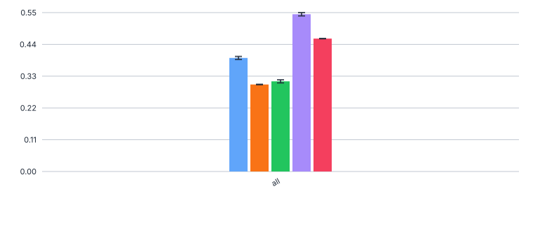 

Micro-Precision (ALL.precision)

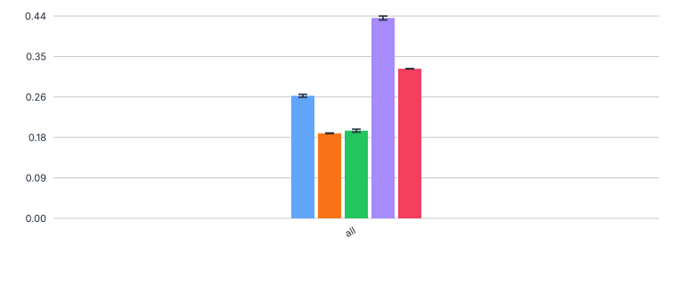

Micro-Recall (ALL.recall)

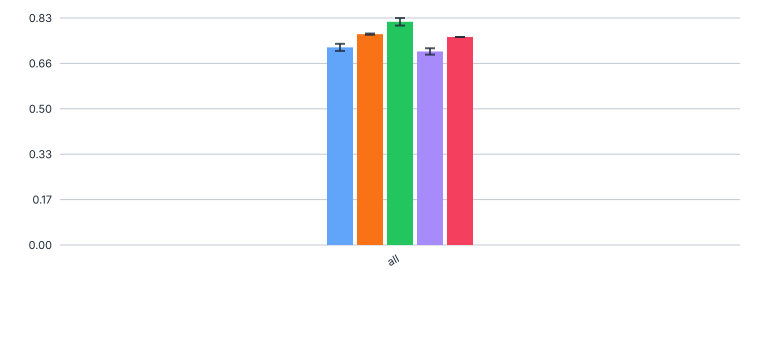

Support


Notes
- Micro-F1 on the flatted schema (per-field evaluation)  - Qwen best with 0.54
- Qwen has very good precision at 0.437, all other models much lower
- Recall is similar across models (0.71-0.82)

#### full compounds

Legend


Micro-F1 (ALL.f1)

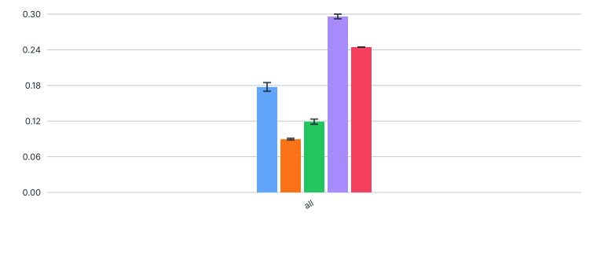 

Micro-Precision (ALL.precision)

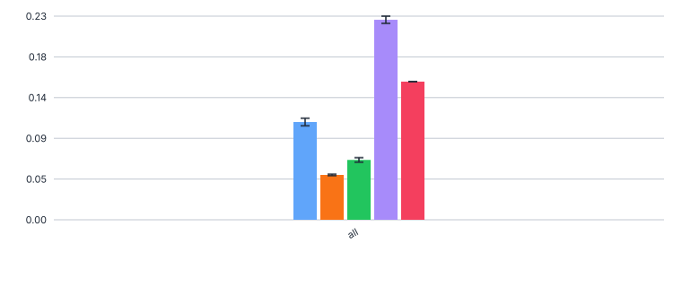

Micro-Recall (ALL.recall)

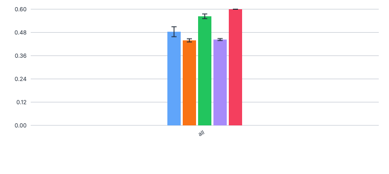

Support


Notes
- F1 scores range from 0.3 (Qwen3) to 0.09 (Mistral)

#### base elements

Legend


Micro-F1 (ALL.f1)

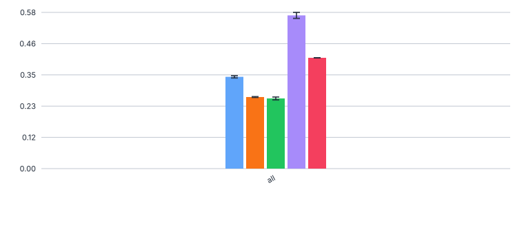 

Micro-Precision (ALL.precision)

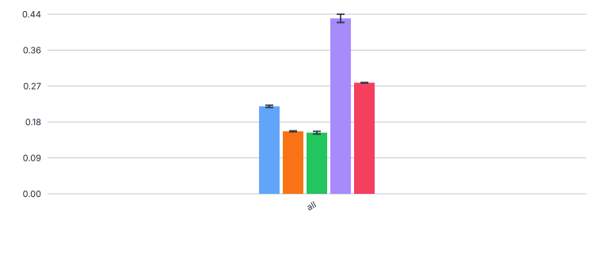

Micro-Recall (ALL.recall)

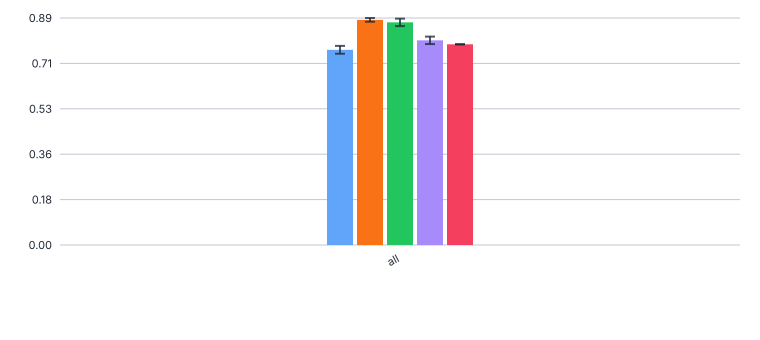

Support


Notes
- Gemma3 and Mistral perform much worse than the other models
- Qwen3 best at 0.564

#### `Antwortvariable` conditioned on base elements

Legend


F1

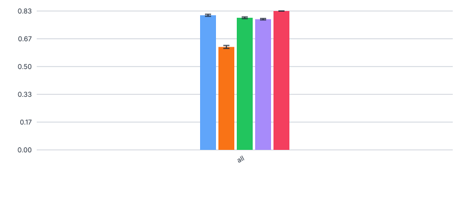 

Precision

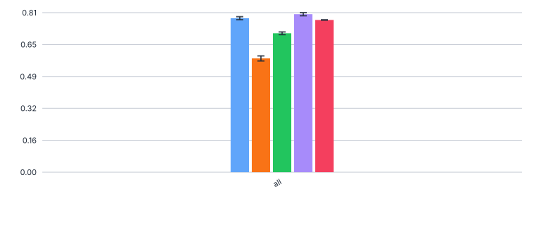

Recall

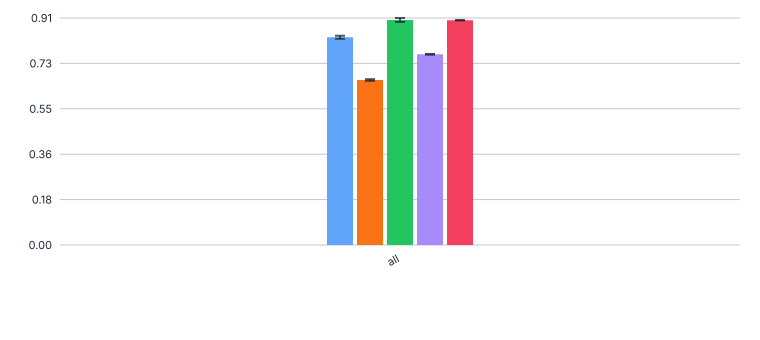

Support


Notes
- All models quite good at F1=0.78-0.83, except Mistral with 0.62
- gpt_5 0.832 on support 173, mistral 0.617 on support 192

#### `Antwortvariable` & `Trend` conditioned on base elements

Legend


F1

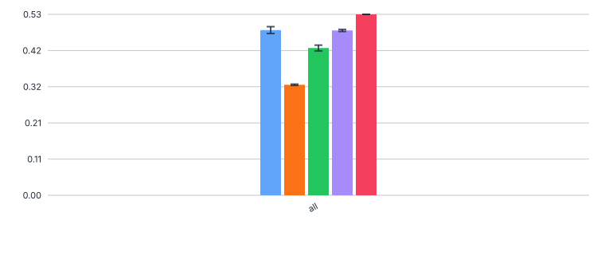 

Precision

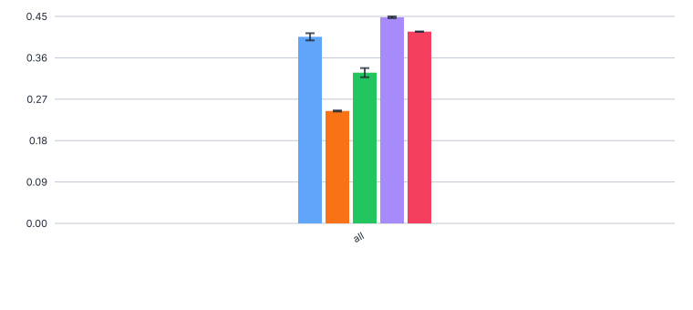

Recall

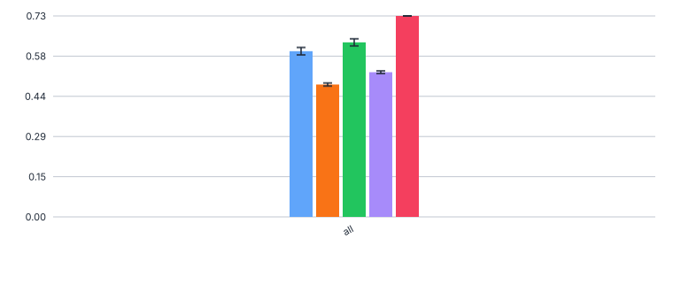

Support

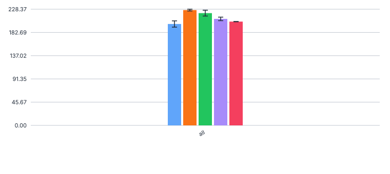

Notes
- GPT5 best at F1 = 0.53, Qwen/GPT OSS at 0.48
- Mistral worst at 0.32
- gpt_5 0.530 on support 204, mistral 0.323 on support 227

### Errors


### no error


### with error

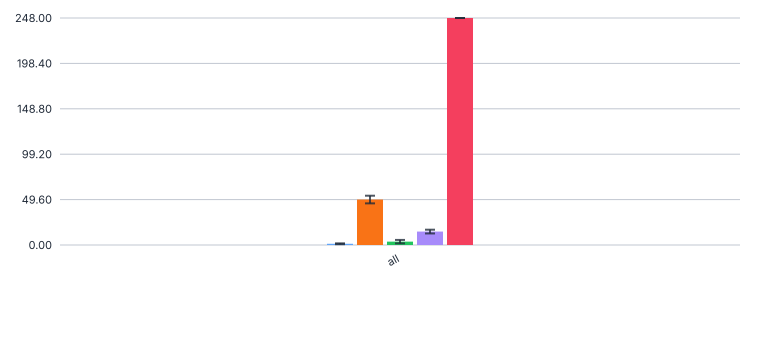

Notes
- GPT5 still has most errors (248, all are non-critical ReasoningExtractionErrors 
- Mistral has the most JSONDecode errors, it loses 44-54 chunks (1.9%) of the 2653 total chunks
- Other models have very few errors (<20).


