# 593_organism_trends_bestconfig_devset_rerun_uncorrected_refs

Evaluation of the best setup (with chunking) from [428_organism_trends_with_chunking](../428_organism_trends_with_chunking), 
but with the full set of input PDFs (59 files were missing) and the uncorrected (!) reference file.

## Evaluation

### F1, P, R
Base for the command is https://github.com/DFKI-NLP/kibad-llm/tree/main/data/prediction_results/logs/593_organism_trends_bestconfig_devset_rerun_uncorrected_refs

##### flattened
```sh
uv run -m kibad_llm.evaluate \
name=593_organism_trends_bestconfig_devset_rerun_uncorrected_refs \
experiment/evaluate=organism_trends_f1_micro_flat \
prediction_logs=logs/591_organism_trends_bestconfig_devset_rerun/predict \
hydra.callbacks.save_job_return.multirun_show_file_contents=null \
dataset.references.file="../external/organism_trends/Weighted Vote Count Wald Literatur - Sheet1.csv" \
--multirun
```

Saved to `logs/593_organism_trends_bestconfig_devset_rerun_uncorrected_refs/evaluate/multiruns/2026-09-08_09-46-03-367590`

##### full compounds

```sh
uv run -m kibad_llm.evaluate \
name=593_organism_trends_bestconfig_devset_rerun_uncorrected_refs \
experiment/evaluate=organism_trends_f1_micro \
prediction_logs=logs/591_organism_trends_bestconfig_devset_rerun/predict \
hydra.callbacks.save_job_return.multirun_show_file_contents=null \
dataset.references.file="../external/organism_trends/Weighted Vote Count Wald Literatur - Sheet1.csv" \
--multirun
```

Saved to `logs/593_organism_trends_bestconfig_devset_rerun_uncorrected_refs/evaluate/multiruns/2026-09-08_09-46-39-788873`

##### base elements

```sh
uv run -m kibad_llm.evaluate \
name=593_organism_trends_bestconfig_devset_rerun_uncorrected_refs \
experiment/evaluate=organism_trends_f1_micro_base_entries \
prediction_logs=logs/591_organism_trends_bestconfig_devset_rerun/predict \
hydra.callbacks.save_job_return.multirun_show_file_contents=null \
dataset.references.file="../external/organism_trends/Weighted Vote Count Wald Literatur - Sheet1.csv" \
--multirun
```

Saved to `logs/593_organism_trends_bestconfig_devset_rerun_uncorrected_refs/evaluate/multiruns/2026-09-08_09-47-21-670244`

##### `Antwortvariable` conditioned on base elements

```sh
uv run -m kibad_llm.evaluate \
name=593_organism_trends_bestconfig_devset_rerun_uncorrected_refs \
experiment/evaluate=organism_trends_f1_micro_conditional_variable_only \
prediction_logs=logs/591_organism_trends_bestconfig_devset_rerun/predict \
hydra.callbacks.save_job_return.multirun_show_file_contents=null \
dataset.references.file="../external/organism_trends/Weighted Vote Count Wald Literatur - Sheet1.csv" \
--multirun
```

Saved to `logs/593_organism_trends_bestconfig_devset_rerun_uncorrected_refs/evaluate/multiruns/2026-09-08_09-49-14-795492`

##### `Antwortvariable` & `Trend` conditioned on base elements

```sh
uv run -m kibad_llm.evaluate \
name=593_organism_trends_bestconfig_devset_rerun_uncorrected_refs \
experiment/evaluate=organism_trends_f1_micro_conditional_variable_and_trend \
prediction_logs=logs/591_organism_trends_bestconfig_devset_rerun/predict \
hydra.callbacks.save_job_return.multirun_show_file_contents=null \
dataset.references.file="../external/organism_trends/Weighted Vote Count Wald Literatur - Sheet1.csv" \
--multirun
```

Saved to `logs/593_organism_trends_bestconfig_devset_rerun_uncorrected_refs/evaluate/multiruns/2026-09-08_09-49-36-794485`

### Errors

```sh
uv run -m kibad_llm.evaluate \
name=593_organism_trends_bestconfig_devset_rerun_uncorrected_refs \
experiment/evaluate=prediction_errors \
hydra.callbacks.save_job_return.multirun_show_file_contents=null \
prediction_logs=[\
logs/591_organism_trends_bestconfig_devset_rerun/predict \
] \
--multirun
```

Saved to `logs/593_organism_trends_bestconfig_devset_rerun_uncorrected_refs/evaluate/multiruns//2026-09-08_09-49-58-118920`

## Outcome

### F1, P, R

The results in this folder can serve as a basis for the [Journal experiments](https://github.com/DFKI-NLP/kibad-llm/issues/521),
namely for the Organism Trend schema plots:

#### flattened

Legend


Micro-F1 (ALL.f1)

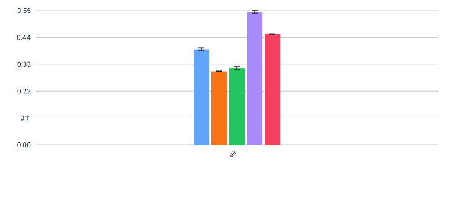 

Micro-Precision (ALL.precision)

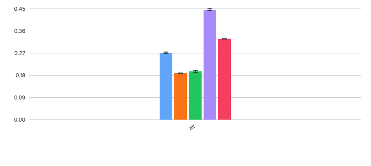

Micro-Recall (ALL.recall)

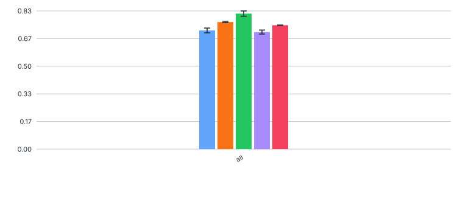

Support

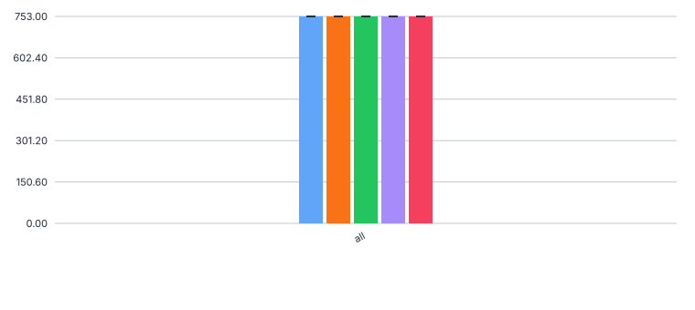

Notes
- Micro-F1 - Qwen best with 0.545
- Qwen has very good precision at 0.444, all other models much lower
- Recall is similar across models (0.71-0.82)
- The results are nearly identical / slightly higher to the results on the corrected dev set

#### full compounds

Legend


Micro-F1 (ALL.f1)

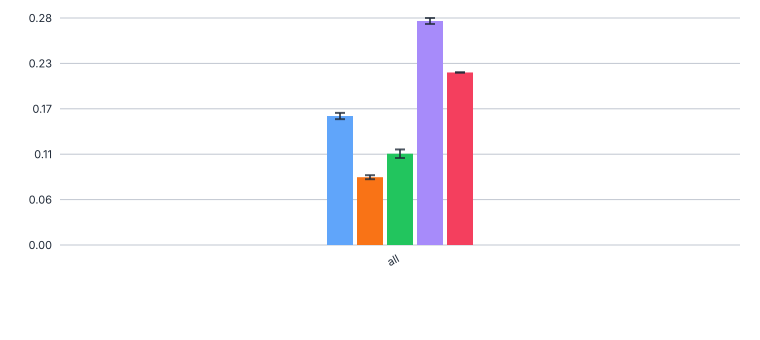 

Micro-Precision (ALL.precision)

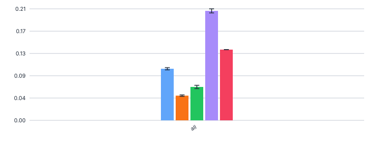

Micro-Recall (ALL.recall)

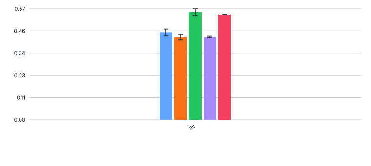

Support

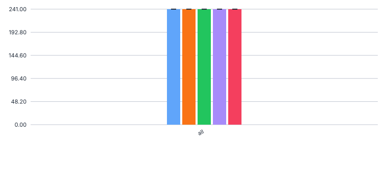

Notes
- F1 scores range from 0.28 (Qwen3) to 0.08 (Mistral)
- Scores are slightly lower (0.5-3 points) than on the corrected dev set

#### base elements

Legend


Micro-F1 (ALL.f1)

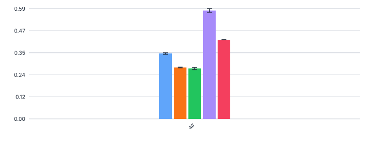 

Micro-Precision (ALL.precision)

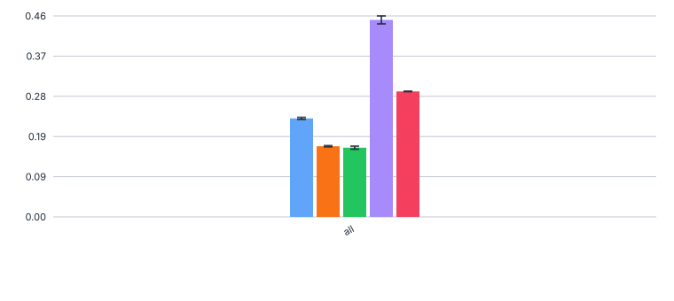

Micro-Recall (ALL.recall)


Support

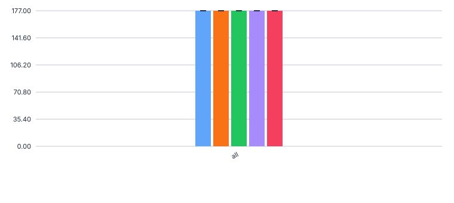

Notes
- Gemma3 and Mistral perform much worse than the other models
- Qwen3 best at 0.58
- Scores are slightly higher than on the corrected dev set

#### `Antwortvariable` conditioned on base elements

Legend

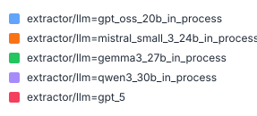

F1

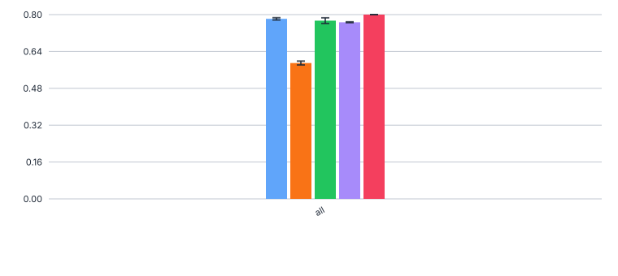 

Precision

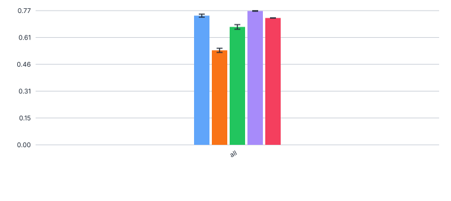

Recall

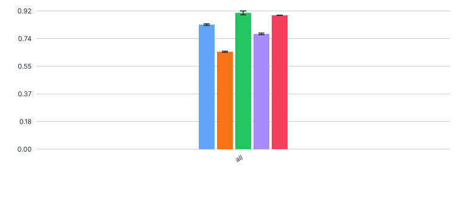

Support


Notes
- All models quite good at F1=0.77-0.80, except Mistral with 0.59
- gpt_5 0.80 on support 172, mistral 0.59 on support 192
- Scores are slightly lower than on the corrected dev set

#### `Antwortvariable` & `Trend` conditioned on base elements

Legend


F1

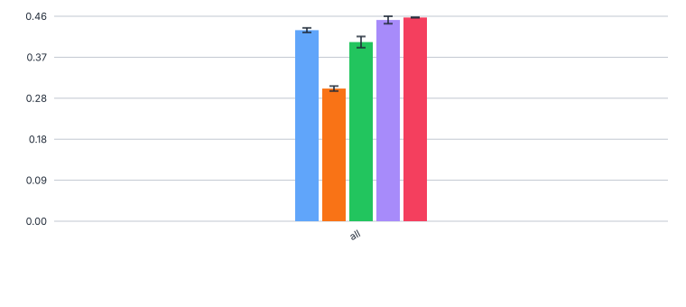 

Precision

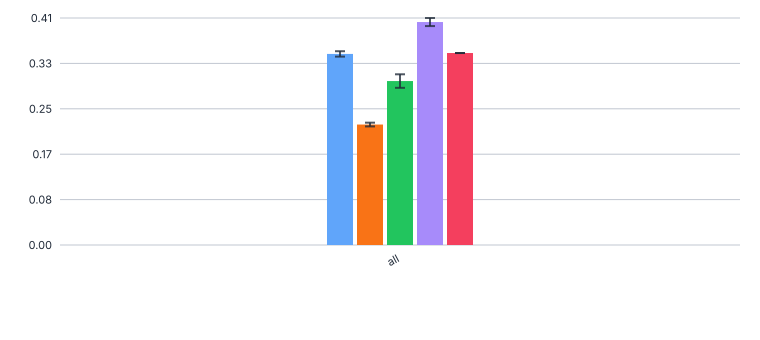

Recall

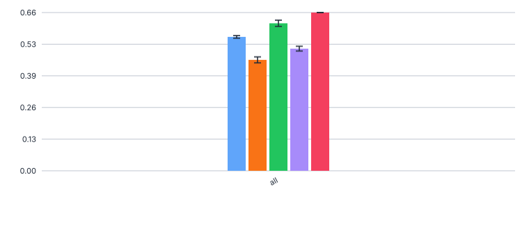

Support

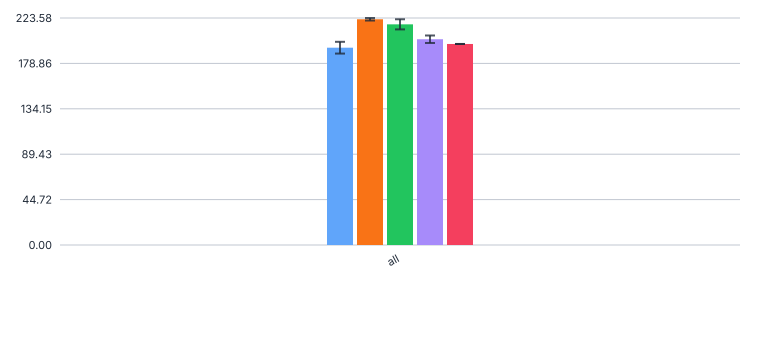

Notes
- GPT5 best at F1 = 0.457, Qwen3 at 0.45
- Mistral worst at 0.298
- gpt_5 0.457 on support 198, mistral 0.298 on support 222
- Scores are lower than on the corrected dev set (3-7 points)

### Errors


### no error

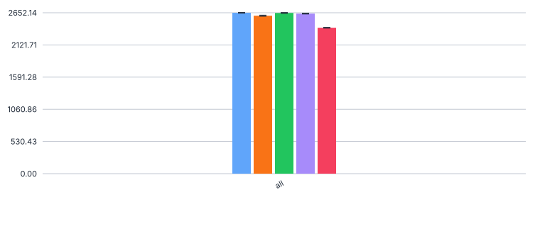

### with error


Notes
- GPT5 still has most errors (248, all are non-critical ReasoningExtractionErrors 
- Mistral has the most JSONDecode errors, it loses 44-54 chunks (1.9%) of the 2653 total chunks
- Other models have very few errors (<20).
- Note: Errors are obviously identical to the corrected reference run in [591_organism_trends_bestconfig_devset_rerun](../591_organism_trends_bestconfig_devset_rerun)


